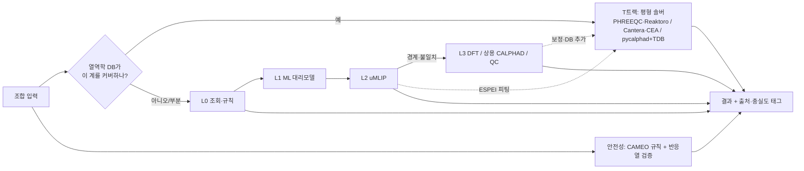

# 02. 시뮬레이션·계산 엔진 조사

- 조사일: 2026-09-26 (버전·라이선스·활동도는 PyPI JSON API, GitHub API, 공식 문서, Matbench Discovery 저장소 YAML로 확인)
- 범위: 조합 시험 시뮬레이션 계층에 래핑하거나 참고할 엔진. 데이터 소스와 플랫폼/UX, LLM 에이전트 도구는 다른 조사원 담당이라 제외했다.
- 표기
  - "미확인": 이번 조사에서 1차 출처로 확인하지 못한 항목
  - "추정": 공개 수치 없이 일반적 경험칙으로 판단한 항목(실측 필요)
  - 적합도 상/중/하: 우리 프레임워크(공공데이터 DB + 조합 시험, Python 중심, 상업화 가능성 열어 둠) 기준
- 이 문서는 법률 자문이 아니다. 라이선스 판단은 배포 전에 법무 검토가 필요하다.

---

## 0. 요약

### 핵심 결론

1. **신규 무기 화합물 안정성은 L2(uMLIP)가 주력이다.** Matbench Discovery 상위 uMLIP는 F1 0.90~0.93, E_hull MAE 약 18~24 meV/atom 수준이다. 조성만 쓰는 ML(L1)은 F1 0.33~0.57에 그쳐 안정성 판정용으로는 약하다. L1은 전처리 필터와 물성 추정용으로만 쓴다.
2. **열역학 DB가 이미 있는 영역은 깔때기가 아니라 평형 솔버가 1순위다.** 수용액(PHREEQC·Reaktoro), 기체(Cantera·NASA CEA), 평가된 합금계(pycalphad+TDB)는 노트북에서 1초 안팎에 끝나고 검증도 충분하다. 이 영역의 병목은 계산량이 아니라 DB 커버리지다. 그래서 계층은 "L0~L3 깔때기 + T트랙(평형 솔버)" 두 축으로 설계할 것을 권고한다.
3. **uMLIP 상위권은 대부분 상업 이용이 가능한 라이선스다.** ORB v3(Apache-2.0), SevenNet-Omni(MIT, 서울대), MatRIS(BSD-3), PET-OAM-XL(BSD-3), NequIP/Allegro·TACE/TECE·Prophet·EquFlashV2(삼성전자)(코드 MIT, 가중치 CC-BY-4.0)가 여기에 속한다. 반대로 GRACE와 MACE의 비-MP 가중치(OMAT/MATPES/MH-1)는 ASL(비상업)이다. UMA와 eSEN은 Meta 자체 라이선스(게이트·이용정책)를 따른다.
4. **기본 스택 권고**
   - 기본값: ORB v3(conservative, MPA 계열) + SevenNet-Omni를 앙상블로 돌려 불확실도를 잡는다.
   - 노트북 경량 대안: MACE-MPA-0(MIT)
   - 배치 처리: TorchSim(MIT)
   - 물성 계산: phonopy, matcalc
5. **GPL/AGPL 엔진은 프로세스 경계로 격리한다.**
   - GPL 계열(QE, CP2K, GPAW, ABINIT, LAMMPS, OpenCalphad, Perple_X)은 별도 워커 컨테이너에서 CLI/파일 I/O로 호출한다.
   - AGPL(ThermoEngine, DAMASK)은 서버 제품에 넣지 않는다.
6. **합성 경로와 동역학 예측은 아직 신뢰 구간이 넓다.**
   - ML 합성가능성 모델은 "합성 가능"을 과대예측한다는 2026년 평가가 있다.
   - 결과는 참고 지표로만 노출하고, E_hull과 열역학 선택성을 기준선으로 둔다.
   - IBM RXN은 2026-10-28에 서비스를 종료하므로 의존하면 안 된다.
7. **MVP(노트북 1대, GPU 선택)**
   - 가능: L0, L1 추론, L2 단일 구조 이완·포논, T트랙 전부, 작은 셀 DFT 검증
   - 불가: 대량 DFT, uMLIP 학습/대규모 파인튜닝, 생성모델 학습, 정량적 동역학·합성 결과 예측
8. **에너지 기준 일관성이 가장 흔한 함정이다.**
   - MP hull과 비교하려면 MP 기준으로 정렬된 모델(MPtrj/sAlex 파인튜닝, 이름에 MPA·OAM이 붙은 계열)을 쓴다.
   - 그렇지 않으면 경쟁상까지 같은 모델로 다시 계산한 자기일관 hull을 써야 한다.

### 전체 비교표

적합도 판단 이유는 각 절에 있다. 비용 표기는 다음과 같다.
- 노트북: CPU로 초~분
- GPU: 단일 GPU 권장
- HPC: 다중 노드 필요

| 엔진 | 시험 유형 | 라이선스 | Python | 비용 | 적합도 |
|---|---|---|---|---|---|
| **안정성·상평형** | | | | | |
| pymatgen (PhaseDiagram·Pourbaix·InterfacialReactivity·Reaction) | E_hull, 분해 생성물, 수계 안정성, 계면 반응 | MIT | 상 | 노트북 | 상 |
| reaction-network | 고상반응 경로·선택성 | BSD-3 | 중 | 노트북 | 중 |
| pycalphad + ESPEI (+scheil, kawin) | 합금 상평형·응고·석출, TDB 파라미터 피팅 | MIT | 상 | 노트북 | 상 |
| Equilipy / Thermochimica (ORNL) | CALPHAD 평형(ChemSage DAT·TDB) | BSD-3 | 중 / 하 | 노트북 | 중 |
| OpenCalphad | CALPHAD 평형 | GPL-3 | 하 | 노트북 | 하 |
| Thermo-Calc / FactSage / Pandat | 상용 CALPHAD(비교 기준) | 상용 | 중~상 | 노트북 | 기준용 |
| **화학평형·반응** | | | | | |
| Cantera | 기체 평형, 반응속도, 연소 | BSD-3 | 상 | 노트북 | 상 |
| NASA CEA | 기체 평형, 연소·폭굉 | Apache-2.0 | 중 | 노트북 | 중 |
| PHREEQC (+phreeqpython, PhreeqcRM) | 수계 종분화, 포화지수, 침전·기체 발생 | USGS 공개 + Apache/BSD 래퍼 | 중 | 노트북 | 상 |
| Reaktoro | 다상 평형·동역학(수계·지구화학) | LGPL-2.1 | 상 | 노트북 | 상 |
| pyEQL | 전해질 용액 물성 | LGPL-3 | 상 | 노트북 | 중 |
| GEMS3K / xGEMS | GEM 평형(시멘트·지구화학) | LGPL-3 (GUI는 학술 전용) | 중 | 노트북 | 중 |
| Perple_X | 고온·고압 암석 상평형 | GPL-3 | 하 | 노트북 | 하 |
| ThermoEngine (ENKI) | 규산염 용융·광물(MELTS) | **AGPL-3** | 중 | 노트북 | 하 |
| SUPCRTBL | 고온·고압 수용액 열역학 DB | 미확인 | 하 | 노트북 | 중(DB로서) |
| CoolProp / thermo·chemicals | 유체·혼합물 물성 | MIT | 상 | 노트북 | 중 |
| GWB / HSC Chemistry | 상용 지구화학·야금(비교 기준) | 상용 | 중 / 하 | 노트북 | 기준용 |
| **원자 단위** | | | | | |
| ASE | 글루(계산기 추상화, 이완, MD) | LGPL-2.1+ | 상 | — | 상 |
| VASP | 평면파 DFT(MP 호환 기준) | 상용(그룹) | 간접 | HPC | 중 |
| Quantum ESPRESSO | 평면파 DFT | GPL-2 | 간접 | HPC·워크스테이션 | 중 |
| GPAW | DFT(Python 네이티브) | GPL-3 | 상 | 워크스테이션 | 중 |
| CP2K / ABINIT | DFT, AIMD / DFPT | GPL-2 / GPL-3 | 간접 | HPC | 하~중 |
| PySCF (+GPU4PySCF) | 분자 양자화학 | Apache-2.0 | 상 | 노트북~GPU | 상(분자) |
| Psi4 | 분자 양자화학 | LGPL-3 | 상 | 노트북~서버 | 중 |
| ORCA | 분자 양자화학 | 학술 무료 / 상업 유료 | 중 | 노트북~서버 | 중 |
| xtb / tblite / g-xTB | 반경험 TB(분자, 빠름) | LGPL-3 (g-xTB 미확인) | 상 | 노트북 | 상 |
| LAMMPS | 고전·MLIP MD | GPL-2 | 중 | GPU~HPC | 중 |
| GROMACS / OpenMM | 연성물질 MD | LGPL-2.1 / MIT·LGPL | 하 / 상 | GPU | 하~중 |
| **uMLIP** (4절 상세) | | | | | |
| ORB v3 (Orbital) | 이완, E_hull, MD, 포논 | Apache-2.0 (코드·가중치) | 상 | 노트북~GPU | 상 |
| SevenNet (서울대) | 동일, 다중 GPU LAMMPS | MIT (현행) | 상 | GPU | 상 |
| MACE | 동일 | 코드 MIT, MP/MPA 가중치 MIT, 그 외 ASL | 상 | 노트북~GPU | 상(MIT 가중치) |
| MatterSim v1 (Microsoft) | 동일 | MIT | 상 | 노트북~GPU | 중 |
| MatGL (M3GNet/TensorNet/CHGNet), CHGNet | 동일(구세대·경량) | BSD-3 | 상 | 노트북 | 중 |
| fairchem UMA / eSEN (Meta) | 재료·분자·촉매 다중 과제 | 코드 MIT, 가중치 Meta 라이선스(게이트) | 상 | GPU | 중 |
| NequIP/Allegro, PET(upet), MatRIS | 동일(상위권) | MIT·BSD-3 + 가중치 CC-BY/BSD | 상 | GPU | 중~상 |
| GRACE (ICAMS) | 동일(상위권) | ASL(비상업) | 상 | 노트북~GPU | 하(상업) |
| TorchSim | uMLIP 배치 이완·MD 엔진 | MIT | 상 | GPU | 상 |
| phonopy / matcalc | 포논, 탄성, EOS 등 물성 계산기 | BSD-3 / BSD | 상 | 노트북 | 상 |
| **물성 예측 ML** | | | | | |
| matminer | 조성·구조 특징 추출 | BSD(수정) | 상 | 노트북 | 상 |
| Roost·Wren(aviary) / CrabNet / MODNet | 조성 기반 물성 | MIT | 상 / 중 / 중 | 노트북 | 중 |
| ALIGNN | 구조 GNN 물성 | NIST(미확인 상세) | 상 | GPU 권장 | 중 |
| RDKit / Chemprop / DeepChem | 분자 기술자·물성 | BSD-3 / MIT / MIT | 상 | 노트북 | 중 |
| **생성·탐색·최적화** | | | | | |
| SMACT | 조성 필터(전하중성·전기음성도) | MIT | 상 | 노트북 | 상 |
| MatterGen | 조건부 결정 생성 | MIT | 상 | GPU | 중 |
| DiffCSP | 결정구조 예측 | MIT | 중 | GPU | 하 |
| BoTorch/Ax, BayBE | 베이지안 최적화, 실험계획 | MIT / Apache-2.0 | 상 | 노트북 | 상 |
| SynthNN, PU-CGCNN, CSLLM | 무기 합성가능성·전구체 | MIT / 미확인 / 미확인 | 중 | 노트북~GPU | 중(참고용) |
| AiZynthFinder / ASKCOS | 유기 역합성 | MIT / MIT | 상 / 중 | 노트북 / 서버 | 하 |
| **거시·혼합 물성** | | | | | |
| 혼합법칙·미세역학(자체 구현) | 복합재 유효 물성 | — | — | 노트북 | 상 |
| FEniCSx | FEM, RVE 균질화 | LGPL-3 | 상 | 노트북~서버 | 중 |
| MOOSE / Elmer | 다중물리, 상장(phase-field) | LGPL-2.1 / GPL+LGPL | 하 | 서버 | 하 |
| kawin | 석출(KWN)·확산 | MIT | 상 | 노트북 | 중 |
| icet / smol / sqsgenerator | 클러스터 전개, SQS | MPL-2.0 / BSD / MIT | 상 | 노트북 | 중 |
| **혼합 위험성** | | | | | |
| CAMEO Chemicals 반응성 그룹 규칙 | 2성분 혼합 위험(발열·기체·독성) | 미 정부 공개(재배포 조건 미확인) | 없음 | ms | 상(L0) |
| CRW4 (CCPS) | 동일 + 재질 호환성 | 무료 배포 | 없음 | ms | 중 |

---

## 1. 조합 안정성·상평형

### 1.1 엔진별 평가

| 항목 | pymatgen | reaction-network | pycalphad + ESPEI | Equilipy / Thermochimica | OpenCalphad |
|---|---|---|---|---|---|
| 최신 | 2026.9.24 (PyPI, 2026-09-23) | 8.3.0 (2024-03-06) | 0.11.2 / 0.9.1 (2026-06-05) | 0.3.3 (2026-07-20) / GitHub 2026-07 커밋 | GitHub 2026-09-25 커밋 |
| 해결 질문 | 이 조성이 hull 위인가, 무엇으로 분해되나, 수계에서 안정한가, 두 상을 섞으면 무엇이 생기고 반응 에너지는 얼마인가 | 전구체 A+B에서 목표 상까지 어떤 경로가 열역학적으로 유리한가 | 합금의 온도·조성별 상분율, 액상선, Scheil 응고, 석출(kawin) | CALPHAD 평형(오픈 대안) | CALPHAD 평형 |
| 라이선스 | MIT | BSD-3 | MIT | BSD-3 | GPL-3 |
| Python API | 상(네이티브, 사실상 표준) | 중(v7부터 graph-tool 대신 rustworkx) | 상 | Equilipy 중, Thermochimica 하(Fortran) | 하(공식 Python 바인딩 상태 미확인; 2026년 Julia 포트 존재) |
| 계산 비용 | ms~s | 수 초~분(화학계 크기에 비례) | 노트북 초~분 | 노트북 | 노트북 |
| 필요 입력 | 계산 엔트리(에너지+조성). MP·OQMD·Alexandria 데이터나 자체 계산 | MP 엔트리(+온도 보정) | **TDB 파일(평가된 DB)** | ChemSage DAT 또는 TDB | TDB |
| 정확도·한계 | 0 K DFT 기준이다. 유한온도는 `GibbsComputedStructureEntry`(Bartel 기술자) 근사로 보정한다. 기준 에너지 혼합(GGA/GGA+U/r2SCAN)은 MP 보정 체계를 따라야 한다 | 열역학 기반이라 동역학·핵생성은 반영하지 않는다. 릴리스가 2024-03 이후 없다 | 정확도는 TDB 품질이 좌우한다. 공개 TDB는 계가 제한적이다 | 상용 DB(FactSage DAT)를 읽을 수 있다 | GPL이라 제품에 결합할 때 제약이 있다 |
| 적합도 | **상**: L0/L2 결과를 판정하는 공통 코어 | 중: 고상반응 경로 참고용 | **상**: 합금 T트랙 코어 | 중: DAT 호환이 필요할 때 | 하 |

- pymatgen 모듈
  - `pymatgen.analysis.phase_diagram`: PhaseDiagram, E_hull, 분해 생성물
  - `pymatgen.analysis.pourbaix_diagram`: 수계 안정성
  - `pymatgen.analysis.interface_reactions.InterfacialReactivity`: 혼합비별 반응 에너지
  - `pymatgen.analysis.reaction_calculator`: 반응식과 반응 엔탈피
- ESPEI: DFT·uMLIP·실험 데이터로 TDB 파라미터를 피팅한다. **L2/L3 결과를 T트랙 DB로 되먹이는 다리 역할**을 한다.
- 관련 도구
  - scheil 0.3.0 (MIT, 2025-11): Scheil 응고
  - kawin 0.5.0 (MIT, 2026-06-05): KWN 석출과 1D 확산. pycalphad로 TDB를 읽는다.

### 1.2 상용 CALPHAD (비교 기준)

| 제품 | 확인 사항 | Python | 비고 |
|---|---|---|---|
| Thermo-Calc | 2026a 출시(2026-01-21). 2026b 릴리스 노트 존재 | TC-Python(2026a 기능 동기화, DICTRA 포함) | Aqueous Calculator가 추가됐다. DB 폭은 업계 최대 수준. 서버 다중 사용자 제공 조건은 계약 확인 필요 |
| FactSage | 8.4 | ChemApp for Python 834.0(2025-09). **Windows 전용** | 산화물·슬래그·염 DB가 강하다. DAT 파일은 Thermochimica/Equilipy에서도 읽힌다 |
| Pandat (CompuTherm) | 버전 미확인 | PanPython 제공(세부 미확인) | Al·Mg 합금이 강하다고 알려짐 |

- 결론: 상용 DB 없이 다성분 상용 합금 정확도를 재현하는 것은 불가능하다. MVP는 오픈 TDB가 있는 계로 한정하고, 상용은 "외부 검증 기준"으로만 둔다.

---

## 2. 화학평형·반응 (기체/수계/지구화학)

| 엔진 | 최신 | 해결 질문 | 라이선스·함의 | Python | 입력 | 한계 | 적합도 |
|---|---|---|---|---|---|---|---|
| **Cantera** | 3.2.0 (2025-11-18) | 기체 혼합물의 평형 조성, 단열 화염온도, 반응속도·점화 | BSD-3, 자유 결합 | 상(py 3.10~3.14) | 메커니즘 YAML(NASA 다항식 열역학 + 반응식) | 메커니즘이 없는 화학계는 반응속도를 풀 수 없다(평형은 가능) | **상** |
| **NASA CEA** | `cea` 3.3.4 (PyPI 2026-08-28) | 평형 조성, 로켓 성능, CJ 폭굉, 충격파 | Apache-2.0 | 중(최근 재구현된 바인딩, py≥3.11) | 내장 2,000+ 화학종 DB | 기체 위주, 응축상은 제한적 | 중(Cantera 교차검증용) |
| **PHREEQC** | 3.8.x (3.8.7: 2025-02, 2026-02 수정) | 수용액 종분화, pH/pe, 광물 포화지수, 침전/용해, 기체 발생, 표면 착물 | USGS 공개 SW. 래퍼: phreeqpython 1.6.2 Apache-2.0(2026-04), phreeqcrm 0.0.20 BSD-3+USGS(2026-06), phreeqpy 0.6.0 BSD-3(2024-06) | 중 | phreeqc.dat, llnl.dat, minteq 등 동봉 DB | 고농도 전해질은 Pitzer DB가 필요하다. 유기물 커버리지가 약하다 | **상** |
| **Reaktoro** | 2.13.0 (conda-forge 2026-02-19) | 다상(수용액·기체·광물) 평형과 동역학, 고온·고압 수계 | LGPL-2.1. 동적 링크·import는 일반적으로 허용 | 상(C++ 코어) | PHREEQC DB, SUPCRT 계열 DB(SUPCRTBL 포함) 사용 가능 | **PyPI 미배포(conda 전용)** | **상** |
| pyEQL | 1.6.5 (2026-08-22) | 전해질 용액의 전도도, 밀도, 활동도 등 물성 | LGPL-3 | 상 | 내장 DB + PHREEQC 엔진 | 물성 중심이고 반응 평형은 PHREEQC에 위임 | 중 |
| GEMS3K / xGEMS | GEMS3K GitHub 2026-09-15 커밋 | GEM 기반 평형(시멘트 수화물, 지구화학) | GEMS3K LGPL-3. GEM-Selektor GUI는 비영리 학술 기관에만 무상 | 중(xGEMS, conda-forge) | GEMS 형식 DB(Cemdata 등) | DB 준비에 GUI가 필요할 수 있다 | 중(시멘트·건설재료 조합 시) |
| Perple_X | GitHub 2026-09-24 커밋 | 고온·고압 암석·광물 상평형(변성·맨틀) | **GPL-3** | 하(Fortran CLI) | 자체 열역학 DB(Holland–Powell 등) | 지질 조건 특화 | 하 |
| ThermoEngine (ENKI) | 공식 문서 1.0.1. PyPI `thermoengine` 2.0.0.dev18은 ThermoEngineLite(py 3.10 전용) | MELTS 계열 규산염 용융·광물 평형 | **AGPL-3**: 네트워크 서비스에서도 소스 공개 의무 | 중 | 내장 MELTS DB | 라이선스 때문에 서버 제품에 부적합 | 하 |
| SUPCRTBL | 최신 버전 미확인 | 고온·고압 수용액 종·광물의 표준 열역학 성질 | 미확인("closed source"로 보고됨) | 하 | — | Reaktoro DB로 간접 사용 권장 | 중 |
| CoolProp / thermo·chemicals | 8.0.0 (2026-06-27) / 0.6.1, 1.5.2 | 순수·혼합 유체 물성(EOS), 상변화, 물성 추정 | MIT | 상 | 내장 DB | 반응 평형은 다루지 않는다 | 중(기체·용매 물성 보조) |
| Geochemist's Workbench | GWB 2026 | 지구화학 반응·반응수송 | 상용 구독 | ChemPlugin(Python·C++·Fortran) | 동봉 DB | 상용 | 기준용 |
| HSC Chemistry | 10 (구독형) | 야금·공정 평형, Eh-pH | 상용 구독(만료 시 동작 중지) | 미확인 | 자체 DB | 상용 | 기준용 |

- 권고
  - 수계: PHREEQC(DB 풍부, 검증 이력 김)와 Reaktoro(Python API, 고온·고압 SUPCRT DB)를 **이중화**한다.
  - 기체: Cantera를 주력으로, NASA CEA를 교차검증에 쓴다.
  - 금속의 수계 안정성: pymatgen Pourbaix를 쓴다. 이미 MP 에너지 기반이라 L0에 해당한다.

---

## 3. 원자 단위 계산

### 3.1 글루와 DFT

| 엔진 | 최신 | 라이선스 | Python | 비용 | 우리 용도 | 적합도 |
|---|---|---|---|---|---|---|
| **ASE** | 3.29.0 (2026-06-21) | LGPL-2.1+ | 상 | — | 모든 계산기(uMLIP·DFT·TB)의 공통 인터페이스, 이완, MD, NEB | **상** |
| VASP | 6.5.1 (2025-03-11 릴리스 확인, 이후 버전 미확인) | 상용. **연구그룹 단위** 라이선스(기관·개인 단위 아님) | ASE, pymatgen, atomate2로 간접 호출 | HPC | MP와 동일 설정으로 L3 검증(MP hull과 직접 비교 가능한 유일한 경로) | 중 |
| Quantum ESPRESSO | 7.5 (2025-08-19) | GPL-2 | 간접(ASE, AiiDA) | 워크스테이션~HPC | 오픈 L3 DFT | 중 |
| GPAW | 26.7.0 (2026-07-06) | GPL-3 | 상(Python 네이티브) | 워크스테이션 | 작은 셀 L3 검증. 단, `import gpaw`하면 GPL이 전파될 수 있다 | 중 |
| CP2K | 2026.1(CMake 전용 빌드로 전환) | GPL-2 | 간접 | HPC | 대형 셀, AIMD, 계면·용액 | 하~중 |
| ABINIT | 10.6.x | GPL-3 | 간접 | HPC | DFPT(유전·포논) | 하 |

- **L3 DFT 주의**: QE나 GPAW 에너지를 MP(VASP PBE/PBE+U, MP2020 보정) hull에 그대로 넣으면 안 된다. 의사퍼텐셜과 설정이 달라 에너지 기준이 어긋나므로, 경쟁상까지 같은 설정으로 다시 계산해야 한다.

### 3.2 분자 양자화학 (용액·기체 반응의 분자 쪽)

| 엔진 | 최신 | 라이선스 | Python | 비고 | 적합도 |
|---|---|---|---|---|---|
| **PySCF** (+GPU4PySCF) | 2.14.0 (2026-07-18) / GPU4PySCF 1.8.1 (2026-08) | Apache-2.0 | 상 | 상업 결합이 자유롭다. GPU 가속 DFT 가능 | **상** |
| Psi4 | 1.10.2 (2026-06-18), v1.11 공지(2026-06) | LGPL-3 | 상 | 고정밀 파동함수 방법 | 중 |
| ORCA | 6.1.1 (2025-12-15) | 학술 무료, 상업은 FAccTs 유료 | 중(OPI `orca-pi` 2.0.0) | 서버 제품에 넣으려면 상업 라이선스 필요 | 중 |
| **xtb / tblite** | tblite 0.7.0 (2026-07-13). xtb는 GitHub 활동 중(PyPI `xtb` 22.1은 2022년 구버전 래퍼) | LGPL-3 | 상(tblite) | 분자 수백 원자를 초 단위로 처리. 반응 에너지 1차 추정, 구조 이완 | **상** |
| g-xTB | v2.0.0(개발판, 최종 구현은 tblite 예정) | 미확인 | 중 | 범용 TB 정확도 개선판 | 중(추적 대상) |
| dftd3 / dftd4 | 1.6.0 / 4.2.0 | LGPL-3 | 상 | 분산 보정 | 상 |

### 3.3 MD

| 엔진 | 최신 | 라이선스 | 비고 | 적합도 |
|---|---|---|---|---|
| LAMMPS | 안정판 22Jul2025 update 6 (2026-09-03), 기능판 2Sep2026 | GPL-2 | uMLIP 대규모 MD(SevenNet·MACE·PET·GRACE 등 플러그인). **별도 프로세스로 호출** | 중 |
| GROMACS | 2026.3 (2026-06-25) | LGPL-2.1 | 2026에서 NNP/MM 지원을 확장했다. 고분자·생체 위주 | 하~중 |
| OpenMM | 8.6.1 (2026-09-11) | MIT(일부 플랫폼 LGPL) | Python 우선 API. 고분자 블렌드나 용액 MD에 활용 | 중 |

---

## 4. 범용 머신러닝 원자간 포텐셜 (uMLIP) 현황 (2026-09)

### 4.1 Matbench Discovery 리더보드

- 출처: https://matbench-discovery.materialsproject.org/ , 저장소 `janosh/matbench-discovery` `models/*.yml`
- 조회일: 2026-09-26
- CPS(Combined Performance Score) = 0.5·F1 + 0.4·κ_SRME(정규화) + 0.1·RMSD(정규화)
  - MD 안정성(CMDS)과 이원자 곡선(CDS)은 CPS에 포함되지 않는다(사이트 명시).
- F1은 unique prototypes 기준, E_hull MAE 단위는 eV/atom
- 공개성 표기: OSOD(코드·데이터 공개), OSCD(학습 데이터 일부 비공개)

| 순위(CPS) | 모델 | 기관 | CPS | F1 | κ_SRME↓ | RMSD↓ | CMDS | E_hull MAE | 파라미터 | 학습 데이터 | 코드 / 가중치 라이선스 | 상업 이용 | 등록일 |
|---|---|---|---|---|---|---|---|---|---|---|---|---|---|
| 1 | Prophet-OAME-MBD | Kairos Materials | 0.912 | 0.928 | 0.065 | 0.059 | 0.578 | 0.018 | 62.3M | MPtrj+OMat24+sAlex+ELEMENTA(비공개, OSCD) | MIT / CC-BY-4.0 | 가능(표시) | 2026-09-13 |
| 2 | TECE-OAM-RRA-1.0 | ShanghaiTech | 0.908 | 0.929 | 0.093 | 0.058 | 0.630 | 0.018 | 222M | MPtrj+OMat24+sAlex | MIT / CC-BY-4.0 | 가능(표시) | 2026-07-05 |
| 3 | EquFlashV2 | **삼성전자 DS부문** | 0.907 | 0.929 | 0.094 | 0.058 | 0.651 | 0.018 | 44.9M | 同 | MIT / CC-BY-4.0 | 가능(표시) | 2026-06-11 |
| 4 | TACE-OAM-RRA-Preview | ShanghaiTech | 0.905 | 0.928 | 0.101 | 0.058 | — | — | 214M | 同 | MIT / CC-BY-4.0(미확인) | — | 2026-06-27 |
| 5 | EquiformerV3+DeNS-OAM | MIT 대학(atomicarchitects) | 0.902 | 0.931 | 0.118 | 0.060 | 0.638 | 0.018 | 30.3M | 同 | MIT / MIT | 가능 | 2026-04-07 |
| 6 | GRACE-3L-OAM-L | ICAMS(보훔대) | 0.900 | 0.925 | 0.121 | 0.058 | 0.739 | 0.018 | 42.1M | 同 | **ASL / ASL** | **불가(비상업)** | 2026-07-02 |
| 7 | PET-OAM-XL | EPFL(lab-cosmo) | 0.898 | 0.924 | 0.119 | 0.060 | 0.634 | 0.019 | 730M | 同 | BSD-3 / BSD-3 | 가능 | 2026-01-10 |
| 8 | TACE-OAM-L | ShanghaiTech | 0.889 | 0.910 | 0.126 | 0.061 | 0.728 | 0.020 | 82.9M | 同 | MIT / CC-BY-4.0 | 가능(표시) | 2026-04-09 |
| 9 | eSEN-30M-OAM | Meta FAIR | 0.888 | 0.925 | 0.170 | 0.061 | 0.625 | 0.018 | 30.2M | 同 | MIT / Meta(OMat24 License) | 조건부(이용정책) | 2025-03-17 |
| 10 | EquFlash | 삼성전자 | 0.888 | 0.919 | 0.158 | 0.060 | 0.678 | — | 28.7M | 同 | 미확인 | — | 2025-06-23 |
| 11 | Nequip-OAM-XL | Harvard(mir-group) | 0.886 | 0.906 | 0.125 | 0.063 | 0.623 | 0.020 | 32.1M | 同 | MIT / CC-BY-4.0 | 가능(표시) | 2025-11-30 |
| 12 | MatRIS-10M-OAM | HPC-AI-Team | 0.877 | 0.921 | 0.218 | 0.060 | — | 0.019 | 10.4M | 同 | BSD-3 / BSD-3 | 가능 | 2025-10-29 |
| 13 | **SevenNet-Omni-i12** | **서울대 MDIL** | 0.873 | 0.906 | 0.192 | 0.062 | 0.626 | 0.021 | 54.9M | COSMOSDataset(243M 구조, CC-BY-4.0) | MIT / MIT | 가능 | 2026-01-12 |
| 14 | Nequip-OAM-L | Harvard | 0.870 | 0.893 | 0.166 | 0.065 | — | 0.022 | 9.6M | MPtrj+OMat24+sAlex | MIT / CC-BY-4.0 | 가능(표시) | 2025-09-08 |
| 17 | ORB v3 (conservative-inf-mpa) | Orbital Materials | 0.860 | 0.905 | 0.210 | 0.075 | — | 0.024 | 25.5M | MPtrj+Alex+OMat24(OSCD) | Apache-2.0 / Apache-2.0 | 가능 | 2025-04-05 |
| 18 | SevenNet-MF-ompa | 서울대 | 0.844 | 0.901 | 0.317 | 0.064 | — | 0.021 | 25.7M | MPtrj+OMat24+sAlex | GPL-3 / GPL-3(등록 당시) | 조건부 | 2025-03-13 |
| 19 | DPA-4.0.1-Pro-MPtrj | DeepModeling | 0.840 | 0.857 | 0.211 | 0.069 | — | 0.029 | 22.8M | **MPtrj만** | LGPL-3 / CC-BY-4.0 | 가능(표시) | 2026-06-11 |
| — | MACE-MPA-0 | Cambridge 등 | 0.795 | 0.852 | 0.412 | 0.073 | — | 0.028 | 9.1M | MPtrj+sAlex | MIT / MIT | 가능 | 2024-12-09 |
| — | MatterSim v1 5M | Microsoft | 0.767 | 0.862 | 0.575 | 0.073 | — | 0.024 | 4.5M | 비공개(OSCD) | MIT / MIT | 가능 | 2024-12-16 |
| — | MACE-MP-0 | Cambridge 등 | 0.637 | 0.669 | 0.682 | 0.092 | — | 0.057 | 4.7M | MPtrj | MIT / MIT | 가능 | 2023-07-14 |
| — | CHGNet | Berkeley(Ceder) | 0.400 | 0.613 | 1.72 | 0.095 | — | 0.063 | 0.4M | MPtrj | BSD-3 / BSD-3 | 가능 | 2023-03-03 |

- 비교 기준(비-uMLIP, 한 번에 예측하는 모델)의 F1: ALIGNN 0.567, CGCNN 0.507, MEGNet 0.510, Wrenformer 0.466, Voronoi RF 0.333. **안정성 판정은 uMLIP 이완이 압도적으로 우세하다.**
- 리더보드 미등재: UMA(Meta), MACE-OMAT-0/MH-1, GRACE-2L-OMAT 등. UMA는 Meta 자체 문서 기준 성능만 존재한다.
- DPA4(DeepModeling, arXiv 2606.02419)
  - MPtrj만으로 학습한 compliant 모델 중 CPS 1위다(DPA4-Pro CPS 0.842).
  - 저자들은 EquiformerV3-MP와 같은 정확도에서 추론 처리량이 11.9배라고 주장한다.
  - 2026-05-22 블로그 기준 "코드 추후 공개". MBD YAML에는 CC-BY-4.0 체크포인트가 등록돼 있다.

### 4.2 계열별 현황

| 계열 | 패키지 최신 | 대표 가중치 | 라이선스(코드 / 가중치) | 특징 | CPU / GPU |
|---|---|---|---|---|---|
| **ORB** (Orbital Materials) | orb-models 0.7.0 (2026-05-26, py≥3.12) | orb-v3 conservative/direct × inf/20이웃 × omat/mpa, OrbMol-v2(2026-05, OMol25+OPoly26, 장거리 정전기) | Apache-2.0 / Apache-2.0 | MBD MD 과제 wall time이 최단 그룹이고, GPU 메모리를 보고한 모델 중 가장 적다(1.6 GB). Alexandria와 WBM 프로토타입 약 97k가 겹친다고 YAML에 명시(누수 가능성) | CPU 지원(Windows 비보장). GPU 권장 |
| **SevenNet** (서울대 한승우 교수 그룹) | sevenn 0.13.0 (2026-06-19) | SevenNet-Omni(i12), MF-ompa, Nano(지식증류 경량), 0 | 현행 저장소·PyPI는 **MIT**. 과거 체크포인트(MF-ompa 등)는 등록 당시 GPL-3 | 국산. LAMMPS 다중 GPU 병렬, CUDA D3 분산 보정, 멀티피델리티, 망각 방지 파인튜닝 | GPU 권장 |
| **MACE** | mace-torch 0.3.16 (2026-05-10) | MP-0a/b/b2/b3, MPA-0(MIT) / OMAT-0, MATPES-PBE/r2SCAN, OMOL-0, MH-0/1, MDP(**ASL**) | MIT / 가중치별 상이 | 생태계가 가장 넓다. MH-1은 분자·표면·벌크 교차 도메인 성능 | 소형은 CPU로 실용적(추정), cuEquivariance로 GPU 가속 |
| **MatterSim** (Microsoft) | mattersim 1.2.5 (2026-05-28, py≥3.12) | v1 1M / 5M | MIT / MIT | 넓은 온도·압력 범위 학습(학습 데이터 비공개). MatterGen 평가 파이프라인이 이완에 사용 | Mac MPS에서는 수치 불안정 보고가 있어 CPU 권장 |
| **MatGL / CHGNet** | matgl 4.0.3 (2026-07-02), chgnet 0.4.2 (2025-09-22) | M3GNet, CHGNet, TensorNet-MatPES(PBE/r2SCAN 2025.2), QET | BSD-3 | v3.0(2026-05)에서 DGL을 제거하고 PyG 전용으로 바꿨다. **메시지패싱 버그 수정으로 구 가중치 무효, 전 모델 재학습**(HF materialyze만 배포) | CPU·MPS 가능. JAX·Warp 가속 옵션 |
| **fairchem UMA / eSEN** (Meta) | fairchem-core 2.23.0 (2026-09-24) | uma-s-1p1, uma-s-1p2, uma-s-1p2p1, uma-m-1p1 / eSEN-30M-OAM | 코드 MIT / 가중치 **FAIR Chemistry License v1**(UMA), OMat24 License(eSEN·eqV2) | 한 모델로 재료(omat)·분자(omol)·촉매(oc20)·MOF(odac)·분자결정(omc) 과제를 처리한다. HF 게이트(실명·생년월일·기관명 입력) | GPU 권장 |
| **GRACE** (ICAMS) | tensorpotential 0.6.1 (2026-09-03) | GRACE-1L/2L/3L-OAM(-L), OMAT | **ASL / ASL** | 정확도와 MD 안정성(CMDS 0.739)이 모두 상위권이지만 상업 이용이 안 된다 | TensorFlow 기반, CPU·GPU |
| **PET / UPET** (EPFL) | upet 0.3.1 (2026-09-25) | PET-MAD-1.6(XS/S/M, r2SCAN, 102원소), PET-OAM-XL, PET-OMat, PET-OMATPES | BSD-3 / BSD-3 | 불확실도 추정 내장. ASE, LAMMPS(KOKKOS), i-PI, TorchSim, GROMACS 연동 | XL(730M)은 GPU 필수(추정), MAD-XS/S는 CPU 가능(추정) |
| **NequIP / Allegro** | nequip 0.19.1 (2026-09-01) | Nequip-OAM-L/XL, Allegro-OAM-L | MIT / CC-BY-4.0 | 컴파일 기반 고속 추론, 대규모 병렬 MD(Allegro) | GPU |
| **DeePMD / DPA** | deepmd-kit 3.2.0 (2026-08-19) | DPA-3.1, DPA-4.0.1 | LGPL-3 / LGPL-3 또는 CC-BY-4.0 | 멀티태스크 사전학습(OpenLAM). DPA4는 효율 중심 | GPU |
| 기타 신규 | — | Prophet(Kairos, 스핀 포함), TACE/TECE, EquiformerV3, MatRIS, Nequix(0.7M, 저예산 학습), AlphaNet(GPL-3), BAM | 대부분 MIT/BSD + CC-BY | 2026년 들어 상위권 교체가 빠르다. Prophet은 논문 미출판(YAML `paper_published` 공란)이고 학습 데이터 일부가 비공개 | 대부분 GPU |

### 4.3 계산 자원 (상대 비교)

- 출처: MBD YAML의 MD 과제 기록(17개 시스템, 주로 H200 1장)
- 구현 최적화 수준이 섞인 수치라 **상대 순서 참고용**이다.

| 모델 | MD 과제 wall time(초) | 보고된 최대 GPU 메모리 |
|---|---|---|
| GRACE-2L-OAM | 13,960 | — |
| ORB v3 | 16,891 | 1.6 GB |
| GRACE-3L-OAM-L | 27,173 | — |
| MACE-MPA-0 | 31,786 | — |
| TACE-OAM-L | 33,626 | 4.4 GB |
| MatterSim v1 5M | 33,705 | — |
| Nequip-OAM-L | 65,074 | — |
| EquFlashV2 | 141,575 (H100) | 14.4 GB |
| PET-OAM-XL | 148,666 | — |
| EquiformerV3-OAM | 173,946 | 39.2 GB |
| SevenNet-Omni-i12 | 178,251 | — |
| TECE-OAM-RRA-1.0 | 187,997 | 19.2 GB |
| eSEN-30M-OAM | 213,187 | — |
| MatRIS-10M-OAM | 511,454 | — |
| Prophet-OAME-MBD | 586,864 (A800) | 18.4 GB |

- 해석
  - "정확도 최상위 = 가장 느림"은 아니다. ORB v3, GRACE, MACE-MPA-0, TACE-OAM-L이 속도·정확도 균형 구간이다.
  - 노트북 CPU 실측치는 공개 자료로 확인하지 못했다(미확인). MVP 착수 시 대표 구조 20개로 직접 측정해야 한다.
  - 학습 비용: ORB v3는 H100 8장 × 125시간, Prophet은 A800 120장 × 36시간(YAML 기재). **uMLIP 사전학습은 MVP 범위 밖이다.**
- 배치 처리: TorchSim(`torch-sim-atomistic` 0.6.2, MIT)
  - MACE, fairchem, SevenNet, ORB, MatterSim, metatomic, Nequix 모델을 GPU에서 배치 이완·MD한다.
  - ASE 대비 "최대 100배"를 주장한다(자체 주장).

### 4.4 uMLIP 선택 권고

| 용도 | 1순위 | 대안 | 이유 |
|---|---|---|---|
| 기본 안정성 스크리닝(상업 가능) | **ORB v3 conservative (MPA 가중치)** | MatRIS-10M-OAM, Nequip-OAM-L | Apache-2.0, 빠름, 메모리 적음, MP 기준 정렬 |
| 국산·앙상블 2번째 모델 | **SevenNet-Omni** | EquFlashV2(삼성, CC-BY) | MIT이고 아키텍처가 달라 불일치 기반 불확실도 추정에 유리 |
| 노트북 CPU 경량 | MACE-MPA-0 | MatterSim v1 1M, CHGNet | MIT/BSD, 소형 |
| 정확도 최우선(GPU 여유) | PET-OAM-XL 또는 TECE / EquFlashV2 | Prophet(검증 부족) | 상위 CPS, 허용적 라이선스 |
| 분자·용액·촉매까지 한 모델로 | UMA(라이선스 수용 시) | OrbMol-v2(Apache), MACE-MH-1(ASL, 연구 전용) | 다중 도메인 |
| MD 안정성 중시 | TACE-OAM-L(CMDS 0.728) | GRACE-3L(ASL, 연구 전용) | CPS 1위 Prophet은 CMDS 40/42위 |

- 운영 규칙
  1. 모든 결과에 모델명·버전·가중치 해시를 기록한다.
  2. 2개 모델 앙상블의 E_hull 차이가 크면 L3로 올린다.
  3. 리더보드 순위는 6개월 단위로 재점검한다(CPS 상위 10개 중 8개가 2026년 등록 모델).
- 에너지 기준 주의
  - OMat24만으로 학습했거나 OMat 헤드를 쓰는 가중치(예: orb-v3-*-omat, UMA omat, MACE-OMAT-0)는 MP 보정 에너지와 기준이 다르다.
  - MP hull과 섞으려면 MPA/OAM 계열을 쓰거나, 경쟁상을 같은 모델로 다시 계산한다(Prophet YAML에도 "MPtrj·sAlex로 MP 에너지 기준에 정렬"이라고 명시).

---

## 5. 물성 예측 ML (L1 대리모델)

| 도구 | 최신 | 라이선스 | 입력 | 용도 | 유지보수 | 적합도 |
|---|---|---|---|---|---|---|
| matminer | 0.10.1 (2026-04-14) | BSD(수정) | 조성·구조 | 특징 추출 + scikit-learn/LightGBM 대리모델 | 활동 중 | **상** |
| Matbench | 0.6 (2022-07) | BSD(수정) | — | 13개 물성 벤치마크 | **정체** | 중(평가용) |
| Roost / Wren (aviary) | GitHub 2026-07 커밋 | MIT | 조성(Wren은 Wyckoff) | 구조 없이 물성 추정 | 활동 중 | 중 |
| CrabNet | 2.0.8 (2023-01, py<3.11) | MIT | 조성 | 조성 트랜스포머 | **정체** | 하 |
| MODNet | 0.4.5 (2025-03) | MIT | 조성·구조 특징 | 소량 데이터 물성 | 저활동 | 중 |
| ALIGNN | 2026.8.11 (2026-08-14) | NIST(저장소 NOASSERTION, PyPI 분류자 MIT) | 구조 | 구조 GNN 물성(밴드갭, 탄성 등) | 활동 중 | 중 |
| MEGNet | 1.3.2 (2022) | BSD | 구조 | — | **MatGL로 이관(구 패키지 사용 중지)** | 하 |
| RDKit | 2026.3.6 (2026-09-03) | BSD-3 | SMILES | 분자 기술자, 반응 SMARTS | 활발 | 상(분자) |
| Chemprop | 2.3.1 (2026-08-04) | MIT | SMILES | 분자 물성 MPNN | 활발 | 중 |
| DeepChem | 2.8.0 (2024-04) | MIT | 다양 | 범용 | 릴리스 정체 | 하 |

- 권고: L1은 다음 세 역할로 한정한다. 조성·구조만으로 안정성을 확정하는 용도로는 쓰지 않는다(4.1 수치).
  - 조성 단계 필터: SMACT와 pymatgen 산화수 추정으로 전하중성을 거른다.
  - 물성 1차 추정: 밴드갭, 체적탄성률 등을 matminer + GBM 또는 ALIGNN으로 구한다.
  - 우선순위 점수: 합성가능성(SynthNN 등, 6절)

---

## 6. 생성·탐색·최적화·합성 경로

### 6.1 구조 생성·탐색

| 도구 | 최신·상태 | 라이선스 | 용도 | 비용 | 적합도 |
|---|---|---|---|---|---|
| SMACT | 4.0.2 (2026-09-24) | MIT | 원소 조합에서 전하중성·전기음성도가 허용하는 조성 열거 | 노트북 | **상** |
| pymatgen 치환 예측기 | pymatgen 내장 | MIT | 알려진 프로토타입에 원소를 치환해 후보 구조 생성 | 노트북 | 상 |
| MatterGen (Microsoft) | 1.0.3 (2025-07), 저장소 2026-08 커밋 | MIT | 화학계·공간군·밴드갭·자성·E_hull·체적탄성률 조건부 생성 | GPU(학습은 다중 GPU) | 중 |
| DiffCSP | 연구 코드(2025-04 이후 커밋 없음) | MIT | 조성 → 결정구조 예측 | GPU | 하 |
| GNoME (DeepMind) | 데이터 확장 2024-08 | 코드 Apache-2.0, **데이터 CC BY-NC 4.0**, 가중치 미공개 | 방법론 참고(SAPS 치환 + AIRSS + 능동학습) | — | 하(직접 사용) |

### 6.2 베이지안 최적화·실험계획

| 도구 | 최신 | 라이선스 | 특징 | 적합도 |
|---|---|---|---|---|
| BoTorch / Ax | 0.18.1 / 1.3.1 (2026-06) | MIT | 표준 BO 엔진. 다목적·제약 지원 | **상** |
| BayBE (Merck KGaA) | 0.15.0 (2026-06-11) | Apache-2.0 | 화학 파라미터 인코딩, 전이학습. 실험계획 친화적 | **상** |
| Atlas | GitHub(the-matter-lab) | MIT | 자율실험실용, 혼합 파라미터·미지 제약 | 하(py 3.9~3.10만 지원) |

- 권고: "어떤 조합을 다음에 시험할지"를 고르는 탐색 루프에 BayBE나 Ax를 쓴다. 목적함수는 L1/L2 점수로 둔다.

### 6.3 무기 합성 경로·합성가능성

| 자원 | 상태 | 라이선스 | 비고 |
|---|---|---|---|
| Text-mined synthesis recipes (Ceder 그룹) | 고상 31,782건 + 졸겔 9,518건, 데이터 버전 2020-07 | **저장소에 라이선스 표기 없음(미확인)** | 전구체·온도 통계에 쓸 수 있으나 노이즈가 있다 |
| reaction-network | 8.3.0 (2024-03) | BSD-3 | 열역학 기반 경로 탐색 |
| SynthNN | GitHub(antoniuk1) | MIT | 조성만으로 합성가능성 판정 |
| PU-CGCNN (저장소 kaist-amsg, snu-micc) | 연구 코드 | 미확인 | 구조 기반 PU 학습. 국내 연구 |
| CSLLM (Nat. Commun. 2025) | GitHub 공개 | 미확인 | 합성가능성 98.6%, 방법 분류 91.0%, 전구체 80.2%(논문 수치, 자체 분할 기준) |
| 합성 예측 ML 평가 (Bartel 그룹, arXiv 2602.04075) | 2026 | — | 최신 ML 모델 4종이 **합성 가능성을 과대예측**한다고 보고했다. E_hull과 열역학 선택성을 평가 기준으로 제안 |

- 권고: 합성가능성 점수는 참고 지표로만 표시한다. 1차 판정 근거는 E_hull(L2/L3), reaction-network 선택성, 텍스트마이닝 전구체 통계 조합으로 둔다.

### 6.4 유기 반응 예측·역합성 (분자 혼합 시나리오용)

| 도구 | 상태 | 라이선스 | 비고 | 적합도 |
|---|---|---|---|---|
| AiZynthFinder | 4.4.1 (2025-12, py<3.13) | MIT | 템플릿 기반 역합성 | 하(우리 범위 밖에 가까움) |
| ASKCOS v2 (MIT) | GitLab `mlpds_mit/askcosv2`, Docker 배포 | MIT | 역합성, 조건 추천, 생성물 예측, 용해도 | 하~중 |
| IBM RXN for Chemistry | **2026-10-28 서비스 종료**. 호스팅 API도 중단. 자체 호스팅판 `rxn-sandbox` 제공 | 래퍼 MIT | 생성물 예측 | **사용 금지(의존 불가)** |

---

## 7. 거시·혼합 물성

| 도구 | 최신 | 라이선스 | 용도 | 적합도 |
|---|---|---|---|---|
| 혼합법칙·미세역학(자체 구현) | — | — | Voigt/Reuss, Hashin–Shtrikman 경계, Mori–Tanaka, Halpin–Tsai, Maxwell–Garnett(유전) 등 해석식 | **상**(L0/L1 블렌드) |
| FEniCSx (DOLFINx) | 0.11.0 (conda-forge 2026-06-23) | LGPL-3 | RVE 균질화, 열·탄성·확산 FEM | 중 |
| MOOSE (INL) | 연속 릴리스(GitHub 2026-09) | LGPL-2.1 | 다중물리, 상장(phase-field), Thermochimica 연동 | 하(입력파일 중심, 빌드 부담) |
| Elmer | GitHub 2026-09 | ElmerSolver 라이브러리 LGPL, GUI와 대부분 솔버 GPL | 다중물리 FEM | 하 |
| kawin | 0.5.0 (2026-06-05) | MIT | KWN 석출·조대화, 1D 확산·균질화. DICTRA/TC-PRISMA의 부분 오픈 대안 | 중 |
| Thermo-Calc DICTRA / TC-PRISMA | 2026a | 상용 | 확산·석출 기준 | 기준용 |
| DAMASK | — | **AGPL-3** | 결정소성·균질화 | 하(라이선스) |
| icet / smol / sqsgenerator | 4.0 (2026-09-05) / 0.5.7 / 0.5.6 | MPL-2.0 / BSD / MIT | 합금 클러스터 전개, 몬테카를로, SQS(uMLIP와 결합해 혼합엔탈피·질서-무질서 계산) | 중 |

- 고분자 블렌드 상용성(Flory–Huggins χ)은 공개 표준 엔진이 없다. 한센 용해도 파라미터 기반 추정(L0/L1)을 기본으로 하고, MD(OpenMM, GROMACS)는 연구 옵션으로 둔다.

---

## 8. 혼합 위험성(반응성) 규칙 기반

| 도구 | 방법론 | 한계 | 적합도 |
|---|---|---|---|
| **CAMEO Chemicals** (NOAA) | 물질마다 반응성 그룹을 하나 이상 부여한다(68개 그룹 데이터시트). 두 물질 간 그룹 쌍별 규칙으로 판정한다. 비적합(적색) 기준: 발열 약 100 cal/g(≈418 J/g) 초과, 불안정·부식성·가연성·독성 생성물, 기체 발생에 따른 압력 상승. 주의(황색): 불안정 반응물, 불순물, 느린 위험 반응 | **2성분 쌍만 평가**하므로 3성분 이상의 협동 반응(예: 글리세린+질산+황산 → 니트로글리세린)은 못 잡는다. 한 물질에 부여된 여러 그룹끼리는 서로 섞지 않는다. 상온·상압(약 24~49 °C, 1 atm) 가정 | **상(L0)** |
| **CRW4** (Chemical Reactivity Worksheet) | 같은 반응성 그룹 방법론에 재질(Materials of Construction) 호환성, 흡착제 호환성을 더했다. NOAA·Dow·CCPS·MTI가 공동 개발했고 현재 AIChE CCPS가 배포·관리한다(무료) | 데스크톱 앱이라 API가 없다. 최신 버전과 데이터 export 형식은 미확인 | 중 |

- 권고
  - L0 규칙으로 CAMEO 방식 그룹×그룹 매트릭스를 쓴다. 규칙 데이터의 기계가독 확보 여부와 재배포 조건은 미확인이다.
  - 여기에 **T트랙 열역학 검증을 결합**한다. Cantera, thermo, 또는 L2/L3 반응 엔탈피로 "418 J/g 초과 발열" 여부를 정량 재평가하고, 평형 계산으로 기체 생성량을 추정한다.
  - 3성분 이상은 모든 쌍을 평가한 뒤 "다성분 미평가" 경고를 반드시 표시한다.

---

## 9. 충실도 계층(fidelity tier) 권고

### 9.1 구조: 깔때기(L0→L3)와 T트랙 병렬

### 9.2 계층별 엔진 배치

| 계층 | 비용/건 | 엔진 | 산출 | 상위 계층으로 올리는 조건(권고값, 튜닝 필요) |
|---|---|---|---|---|
| **L0 조회·규칙** | ms | pymatgen(PhaseDiagram·Pourbaix·InterfacialReactivity, 캐시된 공공 DB 엔트리), SMACT, Hume-Rothery 규칙, CAMEO 그룹 규칙, 혼합법칙 | 기지 화합물 여부, E_hull(DB), 규칙 플래그, 경계값 | DB에 없는 조성·구조, 또는 DB 간 불일치 |
| **L1 ML 대리** | ms~s | matminer+GBM, Roost/Wren, ALIGNN, SynthNN, Chemprop | 물성 추정, 우선순위 점수 | 상위 k개만 L2로 보냄. **안정성은 L1에서 확정하지 않음** |
| **L2 uMLIP** | 초~분/구조(추정) | ORB v3 + SevenNet-Omni 앙상블(TorchSim 배치), phonopy(동역학 안정성), matcalc(탄성·EOS), ASE MD(열안정성), SQS+icet(합금 혼합) | 이완 구조, E_hull(자기일관), 포논 허수 모드, 반응 에너지 | ①\|E_hull\| < 약 70 meV/atom(상위 모델 E_hull RMSE ≈ 0.066 eV/atom). ②두 모델 차이 > 약 30 meV/atom. ③자성·f전자·강상관·전하 결함·용액 분자 포함 |
| **L3 고충실도** | 시간~일 | VASP(MP 호환) 또는 QE/GPAW(자기일관 재계산), 상용 CALPHAD(Thermo-Calc), PySCF/ORCA(분자) | 최종 판정값 | 실험 검증 대상 선정 |
| **T트랙 평형** | ms~s | PHREEQC/Reaktoro, Cantera/NASA CEA, pycalphad(+scheil, kawin), GEMS | 평형 조성, 종분화, 상분율, 기체 발생 | DB 범위를 벗어난 화학종 → L2/L3로 열역학 값 생성 후 DB 보강 |

- 설계 원칙
  1. 모든 결과에 `fidelity_tier`, `engine`, `engine_version`, `model_weights_hash`, `energy_reference`(MP2020 / 자기일관 / OMat) 태그를 붙인다.
  2. 서로 다른 에너지 기준의 값을 한 hull에 섞지 않는다.
  3. L2 결과로 ESPEI 피팅한 TDB는 "L2 유래"로 표시하고 평가 DB와 구분한다.

---

## 10. 조합 유형별 엔진 매핑

| 조합 유형 | 핵심 질문(시험) | 1순위 | 대안 | 비고·한계 |
|---|---|---|---|---|
| **원소 → 화합물**(신규 조성) | 안정한가(E_hull), 어떤 구조인가, 무엇으로 분해되나 | SMACT 필터 → pymatgen(공공 DB hull) → 치환 구조 생성 → **uMLIP 이완(ORB v3 + SevenNet-Omni)** → pymatgen E_hull | MatterGen 화학계 조건 생성, L3 DFT(VASP-MP 호환) | 구조 탐색이 불완전하면 준안정상을 놓친다. 자성·f전자 계는 L3 필수 |
| **광물+광물 → 고상반응** | 반응하나, 생성물은 무엇인가, 반응 에너지는, 몇 도에서 일어나나 | pymatgen **InterfacialReactivity** + `GibbsComputedStructureEntry`(유한온도 근사) | reaction-network(경로·선택성), uMLIP로 DB에 없는 상 보충. 고온·고압 규산염은 Perple_X(GPL, 별도 프로세스)나 FactSage | 동역학(확산·핵생성)은 미반영이라 "열역학적으로 가능"까지만 판정 가능 |
| **화학물질 혼합 → 수용액** | 종분화, pH, 침전(포화지수), 기체 발생, 금속 부식 | **PHREEQC**(phreeqpython) | Reaktoro(고온·고압, SUPCRTBL DB), pyEQL(물성), pymatgen Pourbaix(금속·산화물 안정성) | 고농도는 Pitzer DB 필요. 유기 화학종 DB 커버리지가 약함. 신규 분자는 xtb/PySCF + 연속체 용매로 추정(정확도 낮음) |
| **기체 반응** | 평형 조성, 단열 온도, 점화·반응속도 | **Cantera** | NASA CEA(교차검증), CoolProp/thermo(혼합물 물성) | 반응속도는 메커니즘 파일이 있어야 한다. 신규 화학종 열역학은 xtb/PySCF 열화학으로 추정 |
| **합금** | 상평형, 액상선·고상선, 응고 편석, 석출 | **pycalphad + TDB**(+scheil, kawin) | TDB가 없으면 uMLIP + SQS/icet(혼합엔탈피) → ESPEI로 TDB 생성. 상용은 Thermo-Calc(TC-Python) | 오픈 TDB의 계 수가 제한적이다. uMLIP 유래 TDB는 엔트로피·액상 기술이 약하다 |
| **재료 블렌드 → 복합물성** | 유효 탄성·열전도·유전율, 밀도, 상용성 | **혼합법칙·HS 경계(자체 구현)** | FEniCSx RVE 균질화, 고분자는 한센 파라미터 → Flory–Huggins, MD(OpenMM) | 미세구조(형상·분포·계면) 입력이 없으면 경계값만 제시 가능 |
| **혼합 위험성**(전 유형 공통) | 발열, 기체, 독성, 폭발 위험 | **CAMEO 방식 반응성 그룹 규칙** | CRW4(재질 호환), T트랙 반응열·기체량 정량화 | 3성분 이상 협동 반응은 미평가 경고 필수 |

---

## 11. MVP 범위 (노트북 1대, GPU 선택)

- 전제: 16~32 GB RAM 노트북, 선택적으로 소비자용 GPU 1장
- 처리량 수치는 모두 추정이므로 실측이 필요하다.

| 작업 | CPU만 | +단일 GPU | MVP 판정 |
|---|---|---|---|
| L0 조회·규칙(hull·Pourbaix·계면반응·CAMEO 규칙) | 가능 | — | **포함** |
| L1 사전학습 모델 추론, matminer+GBM 학습 | 가능 | — | **포함** |
| T트랙(PHREEQC, Reaktoro, Cantera, CEA, pycalphad) | 가능 | — | **포함** |
| L2 uMLIP 이완(단위셀~수백 원자, 소·중형 모델) | 가능(느림, 구조당 수 초~수 분 추정) | 원활, TorchSim 배치 | **포함** |
| L2 포논(phonopy, 소형 셀) | 가능(시간 소요) | 원활 | 포함(소수 후보) |
| L2 MD(수천 원자, ns 규모) | 비현실적 | 제한적 | 선택 |
| 대형 uMLIP(PET-OAM-XL 730M, TECE 222M) | 비현실적(추정) | VRAM에 따라 가능 | 선택 |
| 분자 xtb/tblite, PySCF 소분자 DFT | 가능 | GPU4PySCF | 포함 |
| L3 DFT 검증(≤ 약 20원자 셀, PBE) | 가능(수 시간/건, 추정) | 제한적 이득 | **소수 검증만** |
| 대량 DFT 스크리닝, 하이브리드 범함수, AIMD | 불가 | 불가 | **HPC·클라우드 필요** |
| uMLIP 사전학습·대규모 파인튜닝 | 불가 | 소규모 파인튜닝만 | **범위 밖** |
| MatterGen 샘플링 | 비현실적 | 가능(속도 미확인) | 선택 |
| MatterGen·생성모델 학습 | 불가 | 불가 | 범위 밖 |
| 상용 DB 수준의 다성분 합금 CALPHAD | 불가(DB 부재) | — | 범위 밖(오픈 TDB 계만) |
| 정량적 동역학·합성 결과 예측 | 신뢰할 공개 도구 없음 | — | 범위 밖(참고 지표만) |
| RVE FEM(2D·소형 3D) | 가능 | — | 선택 |

- 환경 주의
  - 여러 패키지가 Python ≥ 3.11을 요구한다(pymatgen, pycalphad, fairchem). ORB와 MatterSim은 ≥ 3.12, ThermoEngineLite는 3.10 전용, AiZynthFinder는 < 3.13이다.
  - Reaktoro와 xGEMS는 conda 전용이다.
  - **conda 환경을 엔진군별로 분리**할 것을 권고한다.

---

## 12. 라이선스 리스크

### 12.1 배포 형태별 함의

범례: ○ 가능, △ 조건부, × 불가

| 라이선스 부류 | 해당 엔진(예) | 내부 연구용 | SaaS(서버에서만 실행) | 온프레미스·데스크톱 배포 |
|---|---|---|---|---|
| 허용적(MIT·BSD·Apache·MPL) | pymatgen, pycalphad, Cantera, CEA, ORB, SevenNet(현행), MatterSim, MACE 코드·MP 가중치, PySCF, RDKit, BoTorch, BayBE, MatterGen, FEniCSx 외 | ○ | ○ | ○ (고지 의무, MPL은 파일 단위 공개) |
| 가중치 CC-BY-4.0 | NequIP/Allegro, TACE/TECE, Prophet, EquFlashV2, DPA-4 | ○ | ○ (저작자 표시) | ○ (저작자 표시) |
| 약한 카피레프트(LGPL) | ASE, Reaktoro, GEMS3K, xtb/tblite, Psi4, GROMACS, FEniCSx, MOOSE, deepmd-kit, pyEQL | ○ | ○ | △ 동적 링크·교체 가능 상태 유지, 수정분 공개 |
| 강한 카피레프트(GPL) | QE, CP2K, GPAW, ABINIT, LAMMPS, OpenCalphad, Perple_X, AlphaNet, SevenNet 구 체크포인트 | ○ | △ 서버 내부 실행은 "배포"가 아니지만, 서버 코드를 외부에 배포하는 순간 결합 저작물 전체에 GPL 적용 | △ **별도 프로세스·컨테이너로 분리**(CLI, 파일 I/O, RPC). FSF 해석상 Python `import`는 링크로 간주 |
| AGPL | ThermoEngine, DAMASK | ○ | × (네트워크 이용자에게 소스 공개 의무) | × |
| 학술·비상업 | GRACE(ASL), MACE-OMAT/MATPES/OMOL/MH-1(ASL), GEM-Selektor GUI, ORCA(학술판), GNoME 데이터(CC BY-NC) | △ 학술 주체 요건 확인 | × | × |
| 벤더 자체 라이선스 | UMA(FAIR Chemistry License v1), eSEN/eqV2(OMat24 License) | ○ | △ 상업 이용은 허용되나 이용정책(AUP) 준수, HF 게이트, **중국·러시아·벨라루스 등 제재 지역 제외** | △ 가중치 재배포 조건 확인 필요(미확인) |
| 상용 | VASP, Thermo-Calc, FactSage/ChemApp, Pandat, GWB, HSC | 계약 범위 내 | 계약 확인(다중 사용자 서버 제공 금지 조항 흔함, 미확인) | 계약 확인 |

### 12.2 구체적 위험과 대응

1. **코드와 가중치 라이선스가 다르다.**
   - MACE 코드는 MIT지만 OMAT·MH-1 가중치는 ASL이다.
   - SevenNet은 저장소가 MIT로 바뀌었지만 과거 체크포인트의 재라이선스 여부는 미확인이다.
   - 대응: 모델 레지스트리에 코드·가중치 라이선스를 따로 기록하고, 비상업 가중치는 운영 환경에서 로드를 차단한다.
2. **GPL 전파**
   - GPL 엔진은 `sim-worker-gpl` 컨테이너로 격리한다. 메인 서비스(허용적 라이선스)와는 작업 큐·파일로만 통신하게 한다.
   - `import gpaw`, `import lammps`(파이썬 모듈)는 격리 워커 안에서만 한다.
3. **AGPL 회피**: ThermoEngine(MELTS)이 필요한 규산염 용융 시험은 제품 범위에서 빼거나 상용 대안(FactSage)을 쓴다.
4. **학습 데이터와 벤치마크 누수**
   - ORB v3는 Alexandria와 WBM 프로토타입 약 97k가 겹친다(YAML 명시).
   - Prophet은 학습 데이터 일부가 비공개다.
   - 대응: 리더보드 수치를 그대로 신뢰하지 말고, 자체 검증 세트(우리 DB의 실험 확인 화합물)로 재평가한다.
5. **학습 데이터 라이선스가 가중치에 미치는 영향**: CC BY-NC 데이터(GNoME)로 파인튜닝한 가중치의 상업 이용 가능 여부는 법적으로 불명확하다. 상업 트랙에서는 BY-NC 데이터를 학습에 쓰지 않는다.
6. **서비스 종료 위험**: IBM RXN(2026-10-28 종료)처럼 호스팅 API에 의존하는 엔진은 L0/L1 핵심 경로에 넣지 않는다.
7. **상용 엔진의 서버 제공 조건**: Thermo-Calc, VASP 등은 대개 계약상 제3자 제공이나 서버 공유를 제한한다(개별 계약 확인 필요, 미확인).

---

## 13. 출처 (조회일 2026-09-26)

**리더보드·uMLIP**
- Matbench Discovery 리더보드: https://matbench-discovery.materialsproject.org/
- Matbench Discovery 모델 목록: https://matbench-discovery.materialsproject.org/models
- 모델 YAML(라이선스·지표·학습비용): https://github.com/janosh/matbench-discovery/tree/main/models
- TECE 모델 페이지: https://matbench-discovery.materialsproject.org/models/tece-oam-rra-1.0
- Prophet 모델 페이지: https://matbench-discovery.materialsproject.org/models/prophet-oame-mbd
- SevenNet-Omni 모델 페이지: https://matbench-discovery.materialsproject.org/models/sevennet-omni-i12
- GRACE-3L 모델 페이지: https://matbench-discovery.materialsproject.org/models/grace-3l-oam-l
- DPA4 논문(CPS 가중치 0.5/0.4/0.1 명시): https://arxiv.org/html/2606.02419
- DPA4 발표 블로그: https://blogs.deepmodeling.com/DPA4_05_22_2026
- MACE 파운데이션 모델·라이선스: https://github.com/ACEsuit/mace-foundations
- MACE-MH-1 HF: https://huggingface.co/mace-foundations/mace-mh-1
- SevenNet: https://github.com/MDIL-SNU/SevenNet
- SevenNet v0.13.0: https://zenodo.org/records/20759148
- ORB: https://github.com/orbital-materials/orb-models
- OrbMol-v2: https://huggingface.co/Orbital-Materials/orbmol-v2
- MatterSim: https://github.com/microsoft/mattersim
- MatGL: https://github.com/materialyzeai/matgl
- UMA 가중치·라이선스: https://huggingface.co/facebook/UMA
- OMat24 라이선스: https://huggingface.co/facebook/OMAT24/blob/main/LICENSE
- GRACE: https://github.com/ICAMS/grace-tensorpotential
- UPET: https://github.com/lab-cosmo/upet
- TorchSim: https://github.com/TorchSim/torch-sim
- 버전·라이선스 일괄 확인: PyPI JSON API(https://pypi.org/pypi/<패키지>/json), GitHub REST API(https://api.github.com/repos/<소유자>/<저장소>)

**평형·CALPHAD**
- pycalphad 문서: https://pycalphad.org/docs/latest/
- reaction-network: https://github.com/materialsproject/reaction-network
- kawin: https://github.com/materialsgenomefoundation/kawin
- Equilipy: https://github.com/ORNL/Equilipy
- Thermochimica: https://github.com/ORNL-CEES/thermochimica
- OpenCalphad: https://github.com/sundmanbo/opencalphad
- Thermo-Calc 2026a: https://thermocalc.com/news/thermo-calc-2026a-release-overview/
- ChemApp for Python: https://gtt-technologies.de/software/chemapp/chemapp-for-python/
- FactSage 8.4: https://factsage.com/factsage-edu/
- Reaktoro(conda-forge): https://anaconda.org/conda-forge/reaktoro
- PHREEQC: https://www.usgs.gov/software/phreeqc-version-3 , https://github.com/usgs-coupled/phreeqcrm/releases
- GEMS3K: https://github.com/gemshub/GEMS3K , https://gems.web.psi.ch/GEMS3/downloads/
- ThermoEngine: https://gitlab.com/ENKI-portal/ThermoEngine , https://enki-portal.gitlab.io/ThermoEngine/
- SUPCRTBL: https://hydrogeochem.earth.indiana.edu/software/index.html
- NASA CEA: https://github.com/nasa/cea , https://nasa.github.io/cea/
- GWB ChemPlugin: https://www.gwb.com/plugin.php
- HSC 라이선스: https://www.metso.com/globalassets/portfolio/hsc-chemistry/04-hsc-license-types.pdf

**원자 단위·거시**
- QE 7.5: https://gitlab.com/QEF/q-e/-/releases/qe-7.5
- VASP 6.5.1: https://vasp.at/info/post/new-release-vasp-651/ , 라이선스 FAQ https://vasp.at/info/faq/
- CP2K 2026.1: https://github.com/cp2k/cp2k/releases/
- ABINIT 릴리스 노트: https://docs.abinit.org/about/release-notes/
- ORCA: https://www.faccts.de/orca/
- Psi4: https://psicode.org/posts/
- g-xTB: https://github.com/grimme-lab/g-xtb
- LAMMPS: https://www.lammps.org/news/2026_09_03-stable-update6/
- GROMACS 2026: https://manual.gromacs.org/2026.1/release-notes/2026/2026.1.html
- FEniCSx: https://anaconda.org/conda-forge/fenics-dolfinx
- Elmer 라이선스: https://github.com/ElmerCSC/elmerfem/blob/devel/license_texts/ElmerLicensePolicy.md
- DAMASK: https://directory.fsf.org/wiki/DAMASK

**생성·합성·위험성**
- MatterGen: https://github.com/microsoft/mattergen
- GNoME: https://github.com/google-deepmind/materials_discovery
- Atlas: https://github.com/the-matter-lab/atlas
- ASKCOS: https://arxiv.org/abs/2501.01835 , https://pubs.acs.org/doi/full/10.1021/acs.accounts.5c00155
- IBM RXN 종료 공지: https://github.com/rxn4chemistry/rxn4chemistry
- Text-mined synthesis: https://github.com/CederGroupHub/text-mined-synthesis_public
- SynthNN: https://github.com/antoniuk1/SynthNN
- PU-CGCNN: https://github.com/kaist-amsg/Synthesizability-PU-CGCNN
- CSLLM: https://www.nature.com/articles/s41467-025-61778-y
- 합성 예측 ML 평가: https://arxiv.org/abs/2602.04075
- CAMEO 반응성 그룹: https://cameochemicals.noaa.gov/browse/react
- CAMEO 예측 방법·한계: https://cameochemicals.noaa.gov/help/reactivity/how_reactivity_is_predicted.htm
- CRW4: https://repository.library.noaa.gov/view/noaa/61941 , https://www.aiche.org/ccps/resources/chemical-reactivity-worksheet

---

## 14. 미확인·추가 확인 필요 항목

| # | 항목 | 확인 방법 제안 |
|---|---|---|
| 1 | SevenNet 과거 체크포인트(7net-0, MF-ompa)가 MIT로 재라이선스됐는지 | 저장소 LICENSE 변경 커밋·릴리스 노트 확인, 저자 문의 |
| 2 | UMA 최신판(uma-s-1p2p1)의 파라미터 수, 재료 벤치마크 수치, 가중치 재배포 허용 범위 | FAIR Chemistry License v1 전문과 AUP 정독, 법무 검토 |
| 3 | 노트북 CPU·Apple Silicon에서 uMLIP별 실제 처리량 | MVP 착수 시 대표 구조 20개로 벤치마크(ORB v3, MACE-MPA-0, SevenNet-Omni, MatterSim 1M) |
| 4 | Prophet 논문·데이터(ELEMENTA) 공개 여부, DPA4 코드 공개 상태 | 3개월 후 재확인 |
| 5 | CAMEO 반응성 규칙(그룹×그룹 매트릭스)의 기계가독 제공 여부와 재배포 조건 | NOAA ORR 문의, CRW4 데이터 파일 구조 확인 |
| 6 | CRW4 최신 버전과 데이터 export 형식 | AIChE CCPS 페이지(조회 시 403) 재접근 |
| 7 | SUPCRTBL 라이선스, Text-mined synthesis 데이터셋 라이선스, CSLLM·PU-CGCNN 코드 라이선스 | 각 저장소·저자 문의 |
| 8 | g-xTB 라이선스, tblite 통합 시점 | grimme-lab 저장소 확인 |
| 9 | VASP 6.5.1 이후 버전, Pandat/PanPython 최신 버전, Thermo-Calc 2026b 출시일 | 벤더 공지 확인 |
| 10 | 상용 엔진(Thermo-Calc, VASP, FactSage)의 서버·SaaS 제공 허용 조건 | 벤더 계약서 확인 |
| 11 | ALIGNN 라이선스 정확한 명칭(NIST 공개 SW 조건) | 저장소 LICENSE 원문 확인 |
| 12 | OpenCalphad Python 바인딩 현황 | 저장소 확인 |
| 13 | reaction-network 저장소의 2024-03 이후 개발 활동(릴리스 정체 여부) | GitHub 커밋 로그 확인(API 조회 한도로 미확인) |
| 14 | MatterGen 단일 소비자 GPU에서의 샘플링 시간 | 실측 |
| 15 | 공개 TDB 커버리지(어떤 합금계가 오픈 DB로 가능한지) | 데이터 조사원과 교차 확인 |
| 16 | phase-field 공개 도구(PRISMS-PF 등) 평가 | 미조사. 필요 시 추가 조사 |
