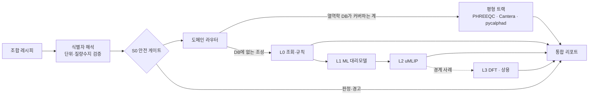
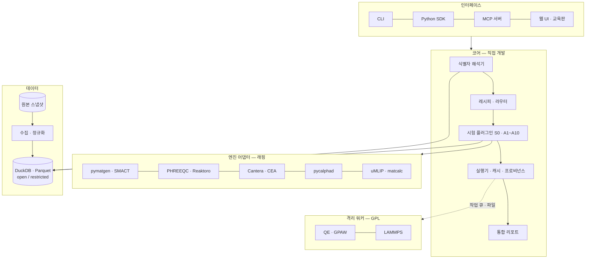

# 02 · 계획서

| | |
|---|---|
| 버전 | 0.5 (2026-09-27) |
| 근거 | [01 벤치마킹 종합](01-벤치마킹-종합.md), [00 조사](00-조사/) 3건 |
| 상태 | 0단계·v0·**1단계 완료** ([05 적재 보고](05-1단계-데이터-코어.md)). 다음은 2단계 |

---

## 한눈에

| 항목 | 내용 |
|---|---|
| 무엇을 | 원소·광물·화학물질을 조합하고, 그 조합에 여러 종류의 가상 시험을 한 번에 돌리는 오픈 프레임워크 |
| 왜 | '조합 → 다방면 시험'을 한 흐름으로 제공하는 제품이 없다. 기존 도구는 도메인별로 끊겨 있다 |
| 어떻게 | 공공데이터 통합 DB, 공통 조합 레시피, 도메인 라우터, 기존 오픈 엔진 래핑, 안전 게이트, 프로비넌스를 묶는다 |
| 차별점 | 엔진이 아니라 **엔진들을 잇는 계층**을 만든다. 오픈·로컬 실행·공공데이터·안전 내장·재현성 |
| MVP | 노트북 1대에서 레시피 한 장을 넣으면 안전 판정·안정성·반응·원료 공급·국내 규제 리포트가 나온다 |
| 결정 | 코어는 연구용 SDK + MCP, 첫 화면은 교육용. 연구 단계에는 비상업 데이터도 파티션을 나눠 허용. Apache-2.0 (11절, D1~D9) |

---

## 1. 목표

**"무엇과 무엇을 어떤 조건에서 섞으면 어떻게 되는가"를 공공데이터와 검증된 계산 엔진으로 여러 각도에서 가상 시험하고, 결과를 출처·신뢰도와 함께 보여 준다.**

### 사용 장면

| 입력 조합 | 알고 싶은 것 | 돌아가는 시험 (3.2절) |
|---|---|---|
| 석회석 + 석영, 1,000 °C | 반응하는가, 무엇이 생기는가, 반응에너지는 얼마인가 | S0 안전, A2 고상반응, A1 생성물 안정성, A9 원료 공급 |
| 차아염소산나트륨 수용액 + 염산 | 섞어도 되는가, pH와 기체 발생은 어떤가 | S0 안전(염소 기체 경고), A4 수용액 평형, A10 국내 규제 |
| Cu + Ni (몰비 7:3) | 몇 도에서 녹는가, 어떤 상이 되는가 | A6 합금 상평형, A7 물성, A9 공급 |
| Li · Co · O 원소 조합 | 안정한 화합물이 있는가 | A1 조성 안정성(L0 → L2 깔때기), A7 물성 |
| 에폭시 + 유리섬유 30 vol% | 복합재의 강성과 밀도는 얼마인가 | A8 블렌드 물성 |

### 하지 않는 것

- **실제 실험을 대체하지 않는다.** 판정은 "열역학적으로 유리하다/불리하다" 수준까지다. 반응 속도, 핵생성, 합성 가능성은 참고 지표로만 보여 준다.
- **계산 엔진을 새로 개발하지 않는다.** 기존 엔진을 래핑만 한다.
- **uMLIP나 생성모델을 학습시키지 않는다.** 공개된 사전학습 모델을 쓴다.
- **위험 물질 생성을 최적화하거나 합성·제조 절차를 제공하지 않는다** (3.4절).

---

## 2. 범위: 조합 유형별 단계

| 조합 유형 | 2단계 (MVP) | 3단계 | 4단계 이후 |
|---|---|---|---|
| 원소 → 화합물 | 공공 DB로 hull 조회 (L0) | — | uMLIP 이완(L2), 물성 계산 |
| 광물·화합물 고상반응 | 반응에너지와 생성물 (L0, 고체 DFT + 기체 열화학 결합) | — | reaction-network로 경로 탐색, DB에 없는 상은 uMLIP로 보충 |
| 수용액 혼합 | 안전 게이트, 국내 규제 | PHREEQC 종분화·포화지수, Pourbaix | Reaktoro 고온·고압 |
| 기체 반응 | 안전 게이트 | Cantera 평형·단열 온도 | 반응속도(메커니즘 파일 필요) |
| 합금 | — | pycalphad + 공개 TDB가 있는 계 | uMLIP + SQS → ESPEI로 TDB 생성(연구 옵션) |
| 블렌드·복합재 | — | 혼합법칙, Hashin–Shtrikman 경계 | FEniCSx로 RVE 균질화 |
| 분자(유기) | 식별, GHS, 반응성 그룹 | — | xtb·PySCF로 반응에너지 추정 |

---

## 3. 핵심 설계

### 3.1 도메인 모델과 조합 레시피

```
Substance (물질) — 모든 성분의 공통 부모
 ├─ Element    원소                 Fe
 ├─ Phase      결정상·화합물         Fe2O3 (공간군 R-3c, mp-…, cod-…)
 ├─ Mineral    광물 (IMA 정본명)      hematite → Phase로 연결
 ├─ Molecule   분자·이온             InChIKey, CAS, PubChem CID
 ├─ Solution   용액                 용매 + 용질 + 농도
 └─ Material   상용 등급·사용자 소재   SUS304 → 조성  [4단계 이후]

Recipe      = [Component(Substance 참조, 양, 상태)] + Conditions(T, P, 분위기, pH, 시간)
Assay       = Recipe → AssayResult        (시험 종류 × 충실도)
AssayResult = 값 + 불확실도 + 경고 + 충실도 태그 + 에너지 기준 + 프로비넌스
Report      = 한 Recipe에 적용된 AssayResult 묶음
```

코드에서는 '시험'을 `assay`라고 부른다. 소프트웨어 테스트(`tests/`)와 헷갈리지 않게 하기 위해서다.

#### 레시피 v0 예시

```yaml
id: rcp-demo-001
name: 석회석 + 석영 소성
components:
  - ref: mineral:calcite     # → CaCO3
    amount: 1 mol
    state: solid
  - ref: mineral:quartz      # → SiO2
    amount: 1 mol
    state: solid
conditions:
  T: 1273 K
  P: 1 atm
  atmosphere: air
assays: auto                 # 라우터가 고른다. [S0, A1, A2, A9]처럼 직접 지정할 수도 있다
```

#### `ref` 네임스페이스

| 네임스페이스 | 예 |
|---|---|
| `element:` | `element:Fe` |
| `formula:` | `formula:Fe2O3` |
| `mp:`, `cod:` | 결정 DB ID |
| `mineral:` | `mineral:hematite` (IMA 정본명) |
| `cas:` | CAS 번호 |
| `cid:` | PubChem CID |
| `inchikey:` | InChIKey |
| `ke:` | 국내 KE 번호 |
| `name:` | 한글·영문 이름. 여러 후보가 걸리면 후보를 제시한다 |

#### 설계 근거

- FactSage Mixture: 이름 붙은 혼합물을 재사용한다.
- Citrine GEMD: 재료, 공정, 측정을 분리해 둔다. 나중에 실제 실험 결과를 같은 레시피 ID에 붙일 수 있게 하기 위해서다.

### 3.2 시험 카탈로그 (다방면 시험)

| 코드 | 시험 | 핵심 질문 | 적용 조합 | 1차 엔진 | 충실도 | 도입 |
|---|---|---|---|---|---|---|
| **S0** | 혼합 안전 게이트 | 섞어도 되는가? 발열·기체·독성은? | 전체 | CAMEO 반응성 그룹 규칙, GHS(PubChem·한국환경공단), 반응열 검산 | L0 (+T) | 2단계 |
| A1 | 조성 안정성 | 이 조성·구조는 안정한가? 무엇으로 분해되는가? | 원소→화합물, 반응 생성물 | pymatgen PhaseDiagram(MP) → uMLIP | L0 → L2 | 2단계(L0), 4단계(L2) |
| A2 | 고상·계면 반응 | 반응하는가? 생성물, 반응에너지, 최적 혼합비는? | 고체 + 고체 | pymatgen InterfacialReactivity·Reaction, 유한온도 G 근사 | L0 | 2단계 |
| A3 | 기체 평형·연소 | 평형 조성과 단열 온도는? | 기체 포함 | Cantera (NASA CEA로 교차검증) | T | 3단계 |
| A4 | 수용액 평형 | pH, 종분화, 침전(포화지수), 기체 발생은? | 수용액 | PHREEQC(phreeqpython) → Reaktoro | T | 3단계 |
| A5 | 수계 안정성·부식 | 이 pH·전위에서 금속·산화물이 안정한가? | 금속·산화물 + 물 | pymatgen Pourbaix | L0 | 3단계 |
| A6 | 합금 상평형 | 상분율, 액상선·고상선, 응고 거동은? | 금속 원소 조합 | pycalphad + 공개 TDB (+scheil) | T | 3단계 |
| A7 | 물성 추정 | 밀도, 밴드갭, 탄성률 등은? | 결정상 | DB 조회 → matminer·ALIGNN → matcalc(uMLIP) | L0 → L2 | 3~4단계 |
| A8 | 블렌드·복합 물성 | 유효 강성, 열전도, 밀도 범위는? | 재료 혼합 | 혼합법칙, Hashin–Shtrikman 경계 (자체 구현) | L0 | 3단계 |
| A9 | 공급·경제성 | 원료 가격, 공급 집중도, 핵심광물 해당 여부는? | 전체 | USGS MCS, World Bank Pink Sheet, 한국광해광업공단 | L0 | 2단계 |
| A10 | 국내 규제 | 유독물 등 규제 대상에 해당하는가? | 화학물질 | 한국환경공단 화학물질·GHS API, KOSHA MSDS | L0 | 2단계 |

- 추가 후보(4단계 이후)
  - XRD 패턴 예측(생성물 식별, RRUFF로 검증)
  - 합성 경로 참고(reaction-network, 텍스트마이닝 레시피)
  - 환경 영향(간이 LCA)
- **A2 설계 요점:** 기체가 나오는 반응(예: CaCO3 + SiO2 → CaSiO3 + CO2)은 기체 엔트로피 없이는 판정이 틀린다.
  - 고체: DFT 에너지 + 유한온도 근사(Bartel 기술자)
  - 기체: NASA CEA 열화학의 G(T)
  - 두 값을 한 반응식 안에서 결합한다. MP Pourbaix가 DFT 고체 에너지와 실험 이온 에너지를 결합하는 것과 같은 원리다.

#### 플러그인 인터페이스

```python
class Assay(Protocol):
    code: str                                   # "A2"
    domains: set[Domain]                        # 라우터가 적용 여부를 판단할 때 쓴다
    def applicable(self, recipe: Recipe) -> Applicability: ...
    def run(self, recipe: Recipe, ctx: RunContext) -> AssayResult: ...
```

시험은 순수 함수로 만든다. 같은 입력에는 같은 출력이 나와야 캐시가 성립한다.

### 3.3 실행 구조: 라우터, 깔때기, 평형 트랙



#### 라우팅 규칙 v0

| 조건 | 적용 시험 |
|---|---|
| 항상 | S0, A9 |
| 고체 무기 성분만 있음 | A1, A2 (+A7) |
| 물 + 용질 | A4, 금속·산화물이 있으면 A5 추가 |
| 기체 성분이 있거나 연소 조건 | A3 |
| 금속 원소만 있음 | A6, A1 |
| 분자 성분이 있음 | A10, S0 강화(GHS) |

#### 충실도 계층

| 계층 | 비용/건 | 대표 엔진 | 역할 |
|---|---|---|---|
| L0 조회·규칙 | ms | pymatgen(공공 DB 엔트리), SMACT, CAMEO 규칙, 혼합법칙 | 알려진 것은 즉시 답한다 |
| L1 ML 대리모델 | ms~s | matminer + GBM, ALIGNN | 필터와 물성 1차 추정. **안정성 판정은 여기서 확정하지 않는다** |
| L2 uMLIP | 초~분/구조 | ORB v3 + SevenNet-Omni 앙상블, 노트북 경량판은 MACE-MPA-0 | 신규 조성의 이완, 자기일관 hull, 물성 |
| L3 고충실도 | 시간~일 | QE·GPAW(GPL 워커), 상용 CALPHAD | 경계 사례 최종 확인 |
| T 평형 트랙 | ms~s | PHREEQC, Reaktoro, Cantera, pycalphad | DB가 있는 계는 여기서 바로 답한다 |

- L2에서 L3로 올리는 조건 (엔진 조사 9.2절, 값은 튜닝 필요)
  - \|E_hull\|이 약 70 meV/atom 미만
  - 두 모델의 E_hull 차이가 약 30 meV/atom 초과
  - 자성·f전자·강상관 계

### 3.4 안전 게이트 S0

- **위치:** 레시피가 들어오면 가장 먼저 실행한다. 판정은 모든 리포트의 맨 위에 표시한다.
- **판정:** 적합 / 주의 / 부적합 (CAMEO 3단계). 부적합이면 발열 여부, 발생 기체 종류, 근거 문헌을 함께 보여 준다.
- **규칙 원천**
  - CAMEO 반응성 그룹: PubChem을 경유해 화합물 5,093건의 그룹 매핑을 받는다.
  - 쌍별 규칙: NOAA에 문의한다. 확보하지 못하면 공개 문서를 바탕으로 자체 규칙표를 만든다.
- **정량 보강:** 평형 트랙으로 반응열(약 100 cal/g ≈ 418 J/g 초과 여부)과 기체 발생량을 검산한다.
- **한계 고지:** CAMEO 규칙은 2성분 쌍만 평가한다. 3성분 이상이면 모든 쌍을 평가하되 "다성분 상호작용 미평가" 경고를 반드시 붙인다.
- **정책**
  - 이 기능은 위험을 알리기 위한 것이다.
  - 위험을 극대화하는 목적함수(발열·독성 기체·폭발성 최대화)로는 조합 탐색을 받지 않는다.
  - 리포트와 에이전트 출력에는 합성·제조 절차를 넣지 않는다.

### 3.5 결과 신뢰 규칙

모든 `AssayResult`는 다음 필드를 반드시 갖는다.

| 필드 | 예 | 이유 |
|---|---|---|
| `fidelity` | L0 / L1 / L2 / L3 / T | 정확도 수준을 구분한다 |
| `engine`, `engine_version` | pymatgen 2026.9.24 | 재현성 |
| `model_weights` | orb-v3-conservative-inf-mpa@sha256:… | 가중치 라이선스 확인과 재현성 |
| `energy_reference` | MP2020 / OQMD / self-consistent:orb-v3 | 서로 다른 기준이 한 hull에 섞이지 않게 한다 |
| `conditions_basis` | 0 K DFT / 298 K 표준상태 / 입력 온도 | 조건을 오해하지 않게 한다 |
| `sources` | mp:v2026.04.13, cod:… (각각 라이선스 포함) | 출처와 라이선스 |
| `uncertainty` | ±0.05 eV/atom (앙상블 차이) | 신뢰 구간 |
| `caveats` | "동역학 미반영" 등 | 한계 고지 |

- **표현 규칙**
  - "반응한다"라고 쓰지 않고 "열역학적으로 유리하다(ΔG < 0)"라고 쓴다.
  - 0 K 결과에는 '0 K 계산' 배지를 붙인다.
  - 가능하면 결과 옆에 해당 엔진·모델의 알려진 오차(벤치마크 MAE)를 함께 적는다.

---

## 4. 데이터베이스 구축 계획

### 4.1 데이터 레이어

| 레이어 | 내용 | 1차 소스 (MVP) | 2차 확장 | 비고 |
|---|---|---|---|---|
| **E** 원소 | 118원소 물성, 동위원소, 이온반경, 전기음성도 | 연구용: mendeleev 1.3.0 + CIAAW 2024 원자량 / 배포용: periodictable, PubChem 주기율표, Wikidata | — | mendeleev·CIAAW는 라이선스 미확인이라 `restricted`다 (D10). 값마다 출처 인용키를 보존한다 |
| **C** 계산 결정 | 구조, 형성에너지, hull, 밴드, 탄성 | Materials Project v2026.04.13 (GNoME 배치 제외) | OQMD, Alexandria, JARVIS | 에너지 기준별로 분리 저장한다 |
| **X** 실험 구조 | CIF | COD (CC0, 534,973건) | AMCSD(COD 경유) | 무기·광물만 걸러 중복을 제거한다 |
| **M** 광물 | 광물 정본명, 화학식, 상태 | IMA-CNMNC 2026-09 (6,239종) | Mindat(비상업 한정), RRUFF(검증용) | 광물명을 결정 구조(COD·MP)에 매칭한다 |
| **Q** 분자·안전 | 식별자, GHS, 반응성 그룹 | PubChem, CAMEO 그룹 매핑(PubChem 경유) | EPA CompTox | CAS·InChIKey 크로스워크 |
| **T** 열역학 | 기체·응축상 NASA 다항식, 수계 log K | NASA CEA thermo.inp, PHREEQC 동봉 DB | LLNL, 공개 TDB, Burcat | 엔진 입력 파일을 원형 그대로 보존한다 |
| **G** 수급·경제 | 생산량, 매장량, 가격, 핵심광물 목록 | USGS MCS 2026, World Bank Pink Sheet | 한국광해광업공단 CSV | 연 1회·월 1회 갱신 |
| **K** 국내 규제·안전 | CAS↔KE 번호, 규제 분류, GHS, MSDS | 한국환경공단 화학물질·GHS API, KOSHA MSDS API | 화학물질안전원, KIGAM | KOSHA는 상업 이용 조건을 확인할 때까지 내부용 |

### 4.2 적재 원칙

1. **원본 스냅샷 먼저**
   - 받은 그대로 `data/raw/{source}/{version}/`에 저장하고 체크섬을 기록한다.
   - 가공은 언제나 이 스냅샷에서 다시 돌릴 수 있어야 한다.
2. **레코드 단위 출처:** 모든 레코드에 다음 필드를 둔다.
   - `source`, `source_id`, `source_version`, `retrieved_at`
   - `license`
   - `method` (experimental / DFT-〈범함수〉 / estimated)
   - `correction_scheme`
3. **라이선스 파티션**
   - `open/`: CC0, CC BY, 퍼블릭 도메인, Apache 등
   - `restricted/`: 비상업, 동일조건변경허락, 허가가 필요한 데이터
   - 둘을 물리적으로 분리하고, 배포 빌드에는 `open/`만 넣는다. SA 레코드에는 플래그를 단다.
4. **에너지 기준 분리:** 계산 에너지는 `energy_reference`별로 저장하고, hull도 기준별로 따로 계산한다.
5. **중복 제거:** 결정상은 StructureMatcher로 병합하되 원래 출처 ID를 모두 보존한다.
6. **소스 레지스트리:** `kb/sources.yaml`에 소스별 버전, URL, 라이선스, 갱신 주기, 적재 상태를 기록한다. `장사시설 수급계획 플랫폼`의 `kb/sources.yaml` 방식과 같다.

### 4.3 저장소

- **MVP: DuckDB + Parquet**
  - 서버가 필요 없고 파일로 관리된다.
  - 2차 확장(OQMD 140만 건, Alexandria 580만 건)까지 한 대에서 분석할 수 있다.
- 결정 구조는 pymatgen Structure JSON 열과 원본 CIF 경로로 저장한다.
- 식별자 크로스워크 테이블: `substance_id ↔ {InChIKey, CAS, CID, KE, MP ID, COD ID, IMA명, 한글명}`
  - CAS는 PubChem·Wikidata에서 가져온다. CAS Common Chemistry는 비상업 라이선스라 쓰지 않는다.
- 다중 사용자 웹 서비스 단계(5단계)에서 PostgreSQL 전환을 검토한다.

### 4.4 1단계 적재 목표

| 소스 | 목표 |
|---|---|
| mendeleev + CIAAW | 118원소 전량 |
| Materials Project | S3 summary(280,159건) 중 GNoME 배치를 뺀 전량 |
| COD | 무기·광물 CIF 전량 (필터 후 건수 기록) |
| IMA | 6,239종 전량, 결정 구조 매칭률 측정 |
| PubChem | CAMEO 매핑 5,093 CID + 국내 API 대상 CAS 목록 |
| CAMEO | 68개 그룹 + CID 매핑 |
| NASA CEA | 약 2,100종 |
| PHREEQC | phreeqc.dat, llnl.dat, minteq.v4, pitzer, sit |
| USGS MCS 2026 | 90개 이상 품목 |
| 한국환경공단·KOSHA | 위 CAS 목록 전체 조회 (일일 호출 한도 안에서 분할) |

---

## 5. 시스템 아키텍처

### 5.1 계층



### 5.2 기술 스택

| 영역 | 선택 | 이유 |
|---|---|---|
| 언어 | Python 3.12 | ORB와 MatterSim이 3.12 이상을 요구하고, 엔진 대부분이 Python API를 제공한다 |
| 환경 | uv(코어) + micromamba(Reaktoro·xGEMS 같은 conda 전용 엔진) | 엔진군별로 환경을 분리한다 (엔진 조사 11절) |
| 스키마 | pydantic v2 | 레시피·결과 검증, JSON Schema 자동 생성 |
| 저장 | DuckDB + Parquet | 4.3절 |
| CLI | typer | — |
| 실행·캐시 | 자체 경량 구현: 입력을 정규화한 해시를 결과 캐시 키로 쓰고 프로비넌스 레코드를 남긴다. 원격 실행이 필요해지면 jobflow-remote | AiiDA는 운영 부담(DB + 메시지 브로커)이 크다 |
| 워크플로 교환 | PWD 내보내기 (4단계 이후) | AiiDA·jobflow·pyiron과 호환 |
| 에이전트 | MCP(fastmcp) + 스킬 문서 | MP·Matlantis와 같은 방식 |
| 웹 | 5단계에서 결정 | — |
| 테스트 | pytest + 검증 세트(7절) | — |

### 5.3 디렉토리 구조 (계획)

```
materials-sim-lab/
├── README.md
├── docs/                  조사 · 계획 · 설계
├── kb/
│   ├── licenses.yaml      라이선스 정책 표 (open/restricted 파티션, copyleft 규칙)
│   ├── sources.yaml       데이터 소스 레지스트리
│   ├── engines.yaml       엔진·모델 레지스트리 (코드와 가중치 라이선스를 따로 기록)
│   ├── assays.yaml        시험 카탈로그
│   └── validation/        검증 세트 (알려진 반응 · 상태도 · 위험 조합)
├── data/                  ※ git 제외
│   ├── raw/               원본 스냅샷
│   ├── open/              재배포 가능 파티션
│   └── restricted/        비상업·SA·허가 필요 파티션
├── src/msl/
│   ├── schema/            Substance, Recipe, AssayResult, Provenance
│   ├── registry/          kb/*.yaml 로드·교차 검사 (msl registry check)
│   ├── connectors/        소스별 수집기
│   ├── etl/               정규화 · 적재
│   ├── resolve/           이름 · CAS · 화학식 · 광물명 → 엔티티
│   ├── recipe/            파싱 · 검증 · 라우터 · 조합 공간 생성
│   ├── assays/            시험 플러그인 (S0, A1 …)
│   ├── engines/           엔진 어댑터
│   ├── runtime/           캐시 · 프로비넌스 · 실행기
│   └── report/            통합 리포트
├── workers/               GPL 엔진 격리 컨테이너 (4단계 이후)
├── examples/recipes/      데모 레시피
└── tests/                 pytest
```

### 5.4 라이선스 격리 원칙

- 코어와 배포 패키지에는 허용적 라이선스(MIT·BSD·Apache)와 LGPL(동적 import)만 넣는다.
- GPL 엔진은 `workers/` 컨테이너 안에서만 import한다. 코어와는 작업 큐와 파일로만 통신한다.
- AGPL 엔진과 비상업 가중치는 운영 환경에서 로드를 차단한다. `engines.yaml`의 `allowed_in: [research]` 같은 표시로 관리한다.

---

## 6. 로드맵

### 0단계 · 기반
- [x] 조사·벤치마킹 (`docs/00-조사/`, `01-벤치마킹-종합.md`)
- [x] 계획서 (이 문서)
- [x] 11절 결정: 권고안 채택 ([03 결정 기록](03-결정-기록.md) D1~D10)
- [x] 저장소 골격, uv 환경, pytest (`git init`, Python 3.12, 테스트 71개)
- [x] `kb/licenses.yaml`: 라이선스 정책 표 39종 (파티션·copyleft 규칙)
- [x] `kb/sources.yaml`: 소스 102개 (open 38 · restricted 64, MVP Top 10 순위 전부)
- [x] `kb/engines.yaml`: 엔진·모델 115개 (worker 12 · reference-only 10 · excluded 4)
- [x] `kb/assays.yaml`: 시험 카탈로그 11종
- [x] 스키마 v0(SubstanceRef, Recipe, AssayResult, Provenance)과 데모 레시피 5종 (1절 사용 장면)
- [x] 기관 문의 초안 4건 ([04 기관 문의 초안](04-기관-문의-초안.md))
- [x] 사용자 작업: MP API 키 발급, data.go.kr 활용신청 (2026-09-27)
- [ ] **사용자 작업**: 기관 문의 발송 (NOAA·KOSHA·K-MDS·KRISS)

**완료 기준:** 데모 레시피 5종이 스키마 검증을 통과한다. 레지스트리에 소스와 엔진이 라이선스와 함께 모두 등재돼 있다.
→ **충족** (2026-09-26): `msl recipe check` 5/5, `msl registry check` 통과. 남은 것은 사용자 작업 3건뿐이다.

### v0 · 실행 가능한 최소 버전 (D11, 2단계 일부 선행)
- [x] 해석기 v0 (PubChem 이름·CAS, 원소·화학식, 사용자 정의 소재)
- [x] 라우터 v0, 실행기(캐시·프로비넌스), CLI `msl run`, 웹 화면 `msl serve`
- [x] 실제 계산: S0(자체 규칙 v0), A1·A2·A7(MP), A3(Cantera·NASA), A4(PHREEQC), A8(혼합법칙), A10(data.go.kr 3종)
- [x] A2 평형 트랙 교차검증 (NASA 실험 열화학 ↔ MP+Gibbs 근사 불일치 경고)
- [x] 데모 레시피 8종, 테스트 85개
- [x] data.go.kr 활용신청 3건 승인(개발계정, 2026-09-27) — 사용자 작업 2번 완료

### 1단계 · 데이터 코어 — 완료 (2026-09-27, [05 적재 보고](05-1단계-데이터-코어.md))
- [x] 커넥터 12종 (4.4절 목표 10개 중 8개 충족, COD·국내 규제는 부분 — 보고서 참조)
- [x] 정규화·적재 → DuckDB/Parquet (`open`과 `restricted` 행 단위 자동 분리)
- [x] 식별자 해석기 (원소기호, 화학식·수화물, IMA 광물명, CAS, 영문·국문 이름, KE 번호)
- [x] IMA 광물 ↔ COD 구조 매칭 (3,724/6,239종, 59.7%)
- [x] 적재 현황 명령 `msl db status`

**완료 기준**
- 4.4절 목표를 적재한다. → 부분 (COD 는 메타데이터, 국내 규제는 조회 시 캐시)
- 프로비넌스 필드 결측이 0건이다. → 충족 (적재 시 거부)
- 배포 빌드에 `restricted` 레코드가 0건이다. → 충족
- 해석기 시험 목록 200개 중 95% 이상을 해석한다. → **99.0%**

### 2단계 · 조합 시험 MVP
- [ ] 레시피 파서·검증 (단위, 질량수지)
- [ ] 도메인 라우터 v0
- [ ] 시험 5종: S0 안전 게이트, A1(L0), A2, A9, A10
- [ ] 캐시·프로비넌스 v0
- [ ] 통합 리포트 (Markdown·HTML)
- [ ] 검증 세트 v0 통과 (7절)

**완료 기준:** `msl run examples/recipes/limestone-quartz.yaml`처럼 데모 레시피 3종이 명령 하나로 리포트까지 나온다. 검증 세트 v0 기준(8절)을 충족한다.

### 3단계 · 평형 트랙 확장
- [ ] 시험 5종 추가: A3 기체(Cantera), A4 수용액(PHREEQC), A5 Pourbaix, A6 합금(pycalphad + 공개 TDB), A8 블렌드
- [ ] Reaktoro 이중화 (conda 환경)
- [ ] 조합 공간 생성기 (혼합비 스윕, 원소 부분집합 열거)

**완료 기준:** 시험 10종이 가동된다. PHREEQC 공식 예제, Cantera·CEA 기준값, pycalphad 문서 예제 상태도를 재현한다.

### 4단계 · 깔때기 확장 (L1·L2)
- [ ] 노트북 uMLIP 처리량 실측 (ORB v3, MACE-MPA-0, SevenNet-Omni, 대표 구조 20개)
- [ ] A1 L2: 치환 구조 생성 → uMLIP 이완 → 자기일관 hull → 앙상블 불확실도
- [ ] A7 물성: matcalc(탄성·상태방정식), phonopy(동역학 안정성)
- [ ] L1 대리모델 (matminer + GBM)
- [ ] 다음에 시험할 조합 추천 (BayBE)
- [ ] L2 → L3 승격 규칙 적용

**완료 기준:** 검증 세트의 신규 조성 과제에서 uMLIP 안정성 판정이 MP 참조값 대비 F1 0.85 이상이다(자체 세트 기준).

### 5단계 · 인터페이스
- [ ] MCP 서버 (substance 검색, 레시피 실행, 리포트 조회 등 최소 도구)와 스킬 문서
- [ ] 웹 UI 프로토타입: 교육용 가상 조합 실험실 (시약 선반 → 작업대 → 결과 카드)
- [ ] `open` 파티션을 OPTIMADE 엔드포인트로 공개 (선택)

**완료 기준:** 외부 사용자 5명 이상이 사용성 테스트를 마친다.

### 6단계 · 고충실도·연계 (선택)
- GPL 워커(QE·GPAW)로 L3 검증
- HPC·클라우드 실행 (Materials Square 연동 검토)
- 실제 실험 결과 입력 (ELN 연계)
- 산업 PoC

---

## 7. 검증 전략

결과가 알려진 조합으로 시스템 전체를 점검한다. 검증 세트는 `kb/validation/`에 둔다.

| 시험 | 사례 | 기대 결과 | 확인하는 것 |
|---|---|---|---|
| A2 | BaCO3 + TiO2, 고온 | BaTiO3 + CO2가 열역학적으로 유리 | 기체 엔트로피 결합(3.2절) |
| A2 | CaCO3 + SiO2, 1,000 °C | CaSiO3(규회석) + CO2 | 동일 |
| A2 | MgO + Al2O3 | MgAl2O4(스피넬) | 고체-고체 반응 |
| A2 (음성) | Au + SiO2 | 반응 없음 | 오탐지 |
| A1 | 실험으로 확인된 안정 화합물 표본(COD·MP 교차) | E_hull ≈ 0 | 분류 정확도 기준선 |
| A4 | PHREEQC 매뉴얼 예제 | 공식 출력과 일치 | 엔진 연동 정확성 |
| A4 | 방해석 용해도 vs pH | 문헌 곡선과 일치 | 수계 DB 선택 |
| A3 | 메탄-공기 양론 연소 | 단열 화염온도 약 2,200 K대, CEA와 일치 | 기체 평형 |
| A6 | pycalphad 문서 예제 계 | 문서 상태도 재현 | TDB 연동 |
| S0 | 차아염소산나트륨 + 암모니아 | 부적합 (클로라민 기체) | 위험 탐지 |
| S0 | 차아염소산나트륨 + 산 | 부적합 (염소 기체) | 위험 탐지 |
| S0 | 알칼리 금속 + 물 | 부적합 (수소, 발열) | 위험 탐지 |
| S0 (음성) | 염화나트륨 + 물 | 적합 | 오경보 |
| A9 | USGS MCS 수치 | 원자료와 일치 | 적재 정확성 |

- 안전 게이트는 **재현율(놓치지 않기)을 우선**한다. 오경보는 허용하되 기록한다.
- 검증 세트 규모는 2단계 20건에서 시작해 4단계에 100건까지 늘린다.

---

## 8. 성공 기준

| 영역 | 지표 | 목표 |
|---|---|---|
| 데이터 | 적재 소스 수 | 10개(1단계) → 16개(3단계) |
| 데이터 | 프로비넌스 필드 결측률 | 0% |
| 데이터 | 배포 빌드 안의 `restricted` 레코드 | 0건 |
| 조합 | 성분 해석 성공률 (시험 목록 기준) | 95% 이상 |
| 시험 | 가동 시험 수 | 5종(2단계) → 10종(3단계) → 11종(4단계) |
| 시험 | 검증 세트 통과 | 안전 게이트 재현율 100%, 나머지 90% 이상 |
| 성능 | L0·평형 트랙 레시피 1건 소요 시간 (노트북) | 10초 미만 |
| 재현성 | 같은 입력을 다시 실행할 때 캐시 적중과 결과 동일 | 100% |
| 투명성 | 결과에 충실도·출처·엔진 버전 표기 | 100% |

---

## 9. 리스크

| 리스크 | 영향 | 대응 |
|---|---|---|
| **라이선스 오염**: 비상업·SA·허가 필요 데이터가 섞임 | 상업화와 공개 배포 불가 | 레코드 단위 license 필드, 파티션 분리, 배포 빌드 자동 검사, 법무 검토 |
| CAMEO 쌍별 규칙 확보 실패 | S0 정확도 저하 | PubChem 경유 그룹 매핑과 공개 문서로 자체 규칙표 구축, 평형 트랙 반응열 검산으로 보완 |
| KOSHA MSDS 상업 이용 불가 판정 | 국내 안전 정보 공백 | 내부용으로만 유지하고 한국환경공단·PubChem GHS로 대체 |
| 에너지 기준 혼용 | 안정성·반응 판정 오류 | `energy_reference` 필수 태그, 기준별 hull, 기준이 섞이면 예외 발생 |
| **결과 과신**: 0 K를 실온으로, '열역학적으로 가능'을 '반응한다'로 오해 | 잘못된 의사결정, 교육 오개념 | 표현 규칙, 조건 배지, 한계 문구 자동 삽입 |
| **범위 팽창**: '모든 것을 시뮬레이션' | 완성 불가 | 시험 카탈로그로 범위 고정, 단계별 완료 기준 |
| 엔진 설치·버전 충돌 | 개발 지연 | 엔진군별 환경 분리, 락파일, 이후 컨테이너화 |
| 외부 API 변경·종료 | 수집 중단 | 로컬 스냅샷 우선, 온라인 의존 최소화, 레지스트리에 URL·버전 병기 |
| uMLIP 세대교체 | 권고 모델 노후화 | 모델 레지스트리, 6개월마다 재평가, 자체 검증 세트 |
| 공개 TDB 커버리지 부족 | 합금 시험 범위 제한 | 공개 TDB가 있는 계로 한정한다고 명시. uMLIP + ESPEI는 연구 옵션 |
| 오용 (위험 조합 탐색) | 안전·평판 문제 | 3.4절 정책: 위험 극대화 목적 차단, 절차 정보 미제공 |

---

## 10. 선행 확인

조사에서 미확인으로 남은 항목 중 계획에 영향을 주는 것이다.

| # | 확인할 것 | 영향 | 방법 | 시점 |
|---|---|---|---|---|
| 1 | CAMEO 쌍별 매트릭스 제공 여부와 재사용 조건 | S0 | NOAA 문의 ([데이터 조사 5.2절](00-조사/01-공공데이터-소스.md)) | 0단계 |
| 2 | KOSHA MSDS 상업 이용 가능 여부 | A10, 배포 | KOSHA 문의 | 0단계 |
| 3 | MP 현행 약관, 라이브 총 재료 수, S3의 GNoME 포함 여부 | C 레이어 | API 키 발급 후 약관 확인·집계 | 0단계 |
| 4 | 국가소재연구데이터센터(K-MDS) 라이선스·API | 2차 확장 | 센터 문의 | 1단계 |
| 5 | KRISS 국가참조표준 적재 협약 조건 | 검증 세트 | KRISS 문의 | 3단계 |
| 6 | 공개 TDB가 커버하는 합금계 | A6 범위 | 공개 TDB 저장소 조사 | 3단계 전 |
| 7 | 노트북에서의 uMLIP 처리량 | 4단계 설계 | 실측 | 4단계 착수 |
| 8 | SevenNet 구 체크포인트, UMA 가중치의 라이선스 | 모델 선택 | 저장소·약관 확인 | 4단계 |

---

## 11. 결정 사항 (2026-09-26 확정)

권고안을 전부 채택했다. 확정 내용과 파생 제약은 [03 결정 기록](03-결정-기록.md)에 있다.

| # | 결정할 것 | 선택지 | 결정 | 영향 |
|---|---|---|---|---|
| 1 | **1차 사용자·목적** | 연구용 SDK / 교육용 가상 실험실 / 산업용 스크리닝 | 코어는 연구용 SDK + MCP, 첫 화면은 교육용 | UI 우선순위, 검증 수준 |
| 2 | **라이선스 정책** | (a) 상업 이용 가능한 데이터만 적재 / (b) 연구 단계에는 비상업 데이터도 허용하되 파티션 분리 | (b): `restricted`로 분리해 두면 나중에 (a)로 빌드할 수 있다 | 적재 범위 |
| 3 | 공개 범위 | 오픈소스 공개 / 내부 도구 | 코어를 오픈소스로 공개, **Apache-2.0** (D3) | 의존 엔진 라이선스 조건 |
| 4 | 2~3단계 우선 조합 도메인 | 광물·세라믹 고상반응 / 수용액 / 합금 | 광물·세라믹 → 수용액 → 합금 순 | 데모 시나리오, 검증 세트 |
| 5 | 컴퓨팅 자원 | 노트북만 / GPU 워크스테이션 / 클라우드 | 노트북으로 시작하고 4단계 실측 뒤 결정 | L2 범위 |
| 6 | 상용 DB·엔진 구매 | 없음 / ICSD / Thermo-Calc 등 | 당분간 구매하지 않고 교차검증 기준으로만 참고 | 정확도 상한 |
| 7 | 기관 문의 | NOAA, KOSHA, K-MDS, KRISS | 0단계에 발송 | 10절 |

---

## 12. 바로 다음 할 일

1. 11절 결정 1~4 확정
2. 저장소 골격과 `kb/sources.yaml` 작성 (조사 문서의 소스 등재)
3. 스키마 v0과 데모 레시피 5종
4. MP API 키 발급, 기관 문의 발송
5. 1단계 커넥터를 mendeleev → MP → COD → IMA 순으로 작성

---

## 변경 이력

| 버전 | 날짜 | 내용 |
|---|---|---|
| 0.1 | 2026-09-26 | 초안: 조사 3건을 바탕으로 작성 |
| 0.2 | 2026-09-26 | 11절 권고안 확정(D1~D9), 0단계 착수. 5.3 구조에 licenses.yaml·registry/ 추가 |
| 0.3 | 2026-09-26 | 0단계 산출물 완료. E 레이어를 연구용·배포용으로 분리(D10) |
| 0.4 | 2026-09-26 | 실행 가능한 최소 버전 v0 가동(D11) |
| 0.5 | 2026-09-27 | 1단계 데이터 코어 완료: 12개 소스 262,644행, 해석기 99.0%, A9 가동(D12) |
